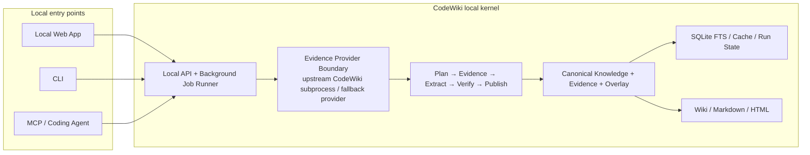
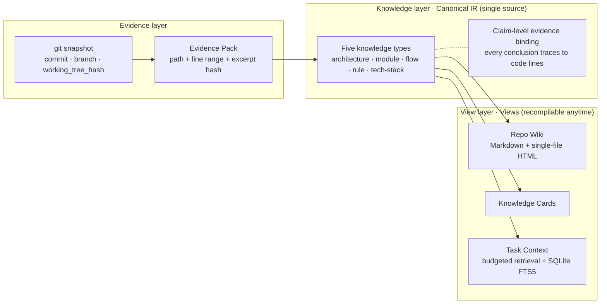
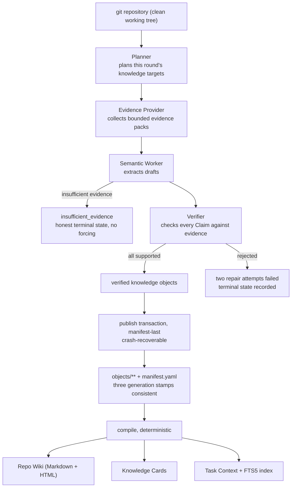
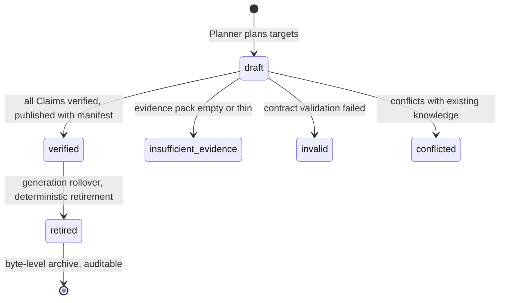

**[中文](./README.md)** · [English](./README.en.md)

# CodeWiki — a repository knowledge compiler

  

[](scripts/verify.sh)
[](pyproject.toml)
[](pyproject.toml)
[](scripts/verify.sh)
[](docs/knowledge/methods/evidence-first-design.md)

**Language**: [中文](./README.md) · **[English](./README.en.md)**

> 📸 **Screenshots auto-generated by GitHub Actions** — see [`.github/workflows/screenshot.yml`](.github/workflows/screenshot.yml). Desktop + mobile README snapshots live under [`assets/screenshots/`](assets/screenshots/).

**CodeWiki** (project design name: Knowledge Compiler) is a local-first repository knowledge compiler for coding agents: it compiles the **verifiable facts** of a git repository into structured knowledge with evidence bindings and commit-scoped expiry, then deterministically compiles three views — Wiki, knowledge cards and task context — from the same Canonical IR.

> In one sentence: **Evidence ≠ Knowledge ≠ Context. Evidence is the repository itself; knowledge is a conclusion that has been verified and bound to evidence; context is the budgeted slice retrieved from knowledge.** The three layers evolve independently, connected by compilation rather than by a "universal vector store".

---

## Next stage: a local knowledge product for individual developers

V0.1 proved the "trusted knowledge compilation" chain can close the loop. The next stage stops treating CodeWiki as just a set of commands and static artifacts, and turns it into a **local knowledge product** individual developers use long-term: install, pick a repository, then parse, build, read, query and feed agent context entirely on your machine — no cloud server required.

### The full design canvas

The three canvases below are the complete output of this product round, not marketing illustrations. They put the project audit, competitor comparison, target architecture, product journey, UI sketches, M9–M14 milestones and scope boundaries into one visual language. Open the [full HTML design draft](docs/design/2026-09-17-local-beta-design.html) locally, or view the [single-page overview image](docs/assets/local-beta-design-overview.png).

<p align="center">
  <a href="docs/assets/local-beta-design-01-audit.png">
    
  </a>
</p>

<p align="center">
  <a href="docs/assets/local-beta-design-02-experience.png">
    
  </a>
</p>

<p align="center">
  <a href="docs/assets/local-beta-design-03-roadmap.png">
    
  </a>
</p>

| Decision | Current choice |
| --- | --- |
| Primary users | Individual developers, developers using coding agents |
| Deployment | Fully local on one machine; zero server dependencies |
| Product strategy | Real credibility validation and beta experience in parallel |
| Pacing | No time promises; milestone exit criteria govern progress |
| Authoritative data | Canonical Knowledge + Evidence + Human Overlay |
| Retrieval | SQLite FTS5 by default; vector search only after benchmarks prove value |

### One kernel — not separate "local" and "cloud" products

CodeWiki has exactly one knowledge model and one compilation pipeline. In the next stage every component runs locally; Web, CLI and MCP are just different entry points into the same kernel:



With local deployment, the machine does the full job: read git repositories, parse code relations, collect and verify evidence, invoke optional models, publish structured knowledge, rebuild search indexes, generate the Wiki, and serve everything through local Web/CLI/MCP. What it stores is far more than embeddings:

| Local data | Standing | Purpose |
| --- | --- | --- |
| Repository snapshot | Fact input | Anchors commit, branch, dirty state and working-tree hash |
| Evidence | Authoritative source | Stores source locations, line ranges, excerpts and content hashes |
| Canonical Knowledge | Authoritative knowledge | Stores architecture/module/flow/rule/tech-stack and Claims |
| Human Overlay | Authoritative human input | Stores manual revisions with explicit conflict handling |
| Run State | Operational state | Stores tasks, leases, retries, failures and generation history |
| SQLite FTS / caches | Rebuildable projection | Powers search, Task Context and performance |
| Wiki / HTML / Markdown | Rebuildable artifacts | Views for human reading, sharing and archiving |

**A vector database is not the source of truth, nor a prerequisite for the local product.** Even if a semantic vector index is added later, it remains derived data rebuildable from Canonical Knowledge; no "similar" result may bypass Claim verification and the snapshot gate.

## Why it's needed

When AI modifies code, the three most common accidents are not "the model wasn't smart enough" but **stale knowledge**:

1. Referencing a module or function that was deleted or renamed an iteration ago;
2. Reciting a three-month-old architecture description long after the abstractions moved;
3. Treating another repository's or another team's conventions as this repository's rules.

The root cause: generic embedding retrieval only answers "which text resembles the question" and never "**does this conclusion still hold at the current commit**". CodeWiki makes that a first-class concern: knowledge objects carry generation / commit / working_tree_hash stamps, and retrieval is gated fail-closed — a snapshot mismatch means refusal. Better less context than stale context.

## Core idea: three separated layers



- The **evidence layer** trusts only git facts: a dirty working tree is rejected outright by the retrieval gate;
- The **knowledge layer** is the single source of truth: every Claim must hang on an evidence pack's excerpt hash, and cannot be marked verified without passing;
- The **view layer** is deterministically regenerated by `compile` from the IR (idempotent reruns are byte-identical) and never hand-edited.

## What it produces (real screenshots)

The screenshots below come from a real five-type build (fixture repository through the full production pipeline — not mockups). Note the coverage bars honestly show `none` for `architecture` and `tech-stack` — when evidence is insufficient the system refuses to fabricate; that's product behavior, not a demo accident:

<p align="center">
  
</p>

Module pages show a Scope table (repository/branch/commit anchors), responsibilities, and **a collapsible evidence block per Claim** — evidence citations carry permalinks (one-click jump to the GitHub/GitLab source line once `init --web-url` is configured):

<p align="center">
  
</p>

The source-index page answers the reverse question "which knowledge cites this code" — evidence bindings are traceable in both directions:

<p align="center">
  
</p>

`compile` also emits a **hostable multi-page static site** (`exports/site/`; the catalog supports search/filter/sortable column headers, and Ask is evidence-only retrieval — it returns matched Claims and evidence anchors, never generative answers); `knowledge serve` starts a local read-only server from the site directory (including a `/api/preview` task-context endpoint; the Ask panel upgrades itself to server-backed mode), the site also ships `history.html` with the generation timeline and two-generation knowledge diffs; the single-file HTML opened by `knowledge open` supports dark mode and full-text search:

<p align="center">
  
</p>

### The human journey in the next version

The existing screenshots document V0.1's real output, not a promise about the next UI. The next round reorganizes existing capabilities around one complete user journey:

1. **Install & preflight**: check Python, Git, parsers, model configuration and disk space, with actionable fix suggestions;
2. **Add a repository**: pick a local directory, configure include/exclude, languages and knowledge goals;
3. **Build knowledge**: background jobs show the current stage, target progress, estimated cost, failure reasons and recovery actions;
4. **Read & audit**: go from the architecture overview into modules, flows, rules and the tech stack, checking each Claim against source evidence;
5. **Ask**: evidence-only results by default; optional model summaries must cite sources claim by claim;
6. **Hand to the agent**: preview Task Context first, then serve the same verified knowledge via MCP or CLI.

The target information architecture follows. Underlying object IDs, generation hashes and diagnostic detail are not removed, but retreat to an "audit & diagnostics" layer and leave the normal reading path:

```text
CodeWiki
├── Overview            system map, trusted coverage, gaps, recent changes
├── Knowledge map
│   ├── Architecture
│   ├── Modules
│   ├── Flows
│   ├── Rules
│   └── Tech stack
├── Ask                 Claim-level results, evidence, related objects
├── Build jobs          stages, progress, failures, retries, recovery
├── Changes & history   generation timeline, knowledge diffs, staleness
├── Data & export       Markdown, HTML, diagnostic bundles, backups
└── Settings & diagnosis  provider capabilities, models, scope, raw IDs
```

The interface design must carry three principles:

- **Conclusions before internal identifiers**: human-readable names, summaries and relations first; raw IDs expand on demand;
- **Trust states are visible**: verified, insufficient, stale, conflicted and degraded each come with a clear explanation and a next action;
- **Back to source within three interactions**: from overview to knowledge conclusion to the supporting code line in at most three major interactions.

## Build pipeline



Exit codes are the contract: `0` = complete, `2` = partial (individual insufficient_evidence targets are normal product behavior), `1` = failed; the report lands in `.knowledge/state/runs/last-build.json`.

## Knowledge lifecycle



Around this state machine sits a set of **honesty semantics**: fail-closed retrieval gating (any of the three generation stamps mismatching means refusal), deterministic retirement (the same input always yields the same retirement set), manifest-last publishing (crash recovery to a consistent state), and a protected human overlay (`knowledge edit`, with contracts for merging and conflict adjudication).

## Quick start

```bash
pip install -e ".[dev]"              # Python 3.12+; only 4 production dependencies

# In the target git repository root (working tree must be clean):
knowledge init --language zh --web-url https://github.com/org/repo   # initializes .knowledge/ (--web-url enables evidence permalinks)
knowledge build --executor llm        # main build (LLM via LiteLLM; agents via queue protocol)
knowledge compile                     # deterministic Wiki/HTML + FTS index rebuild
knowledge context "task description"  # budgeted task context (verified-only, fail-closed gate)
knowledge open                        # open the HTML Wiki (warns if stale)
knowledge serve                       # loopback-only read-only Wiki server
knowledge status                      # object states + latest run's target results
knowledge update --executor llm       # incremental update (exit codes as build)
knowledge edit <object-id>            # edit the protected human overlay

knowledge-mcp <repository-root>       # seven read-only MCP tools (stdio JSON-RPC)
```

LLM credentials flow only through environment variables (`KNOWLEDGE_EXTRACTION_MODEL` + the provider key); they are never stored or written into `.knowledge/`.

## Verification loop

```bash
bash scripts/verify.sh
```

One command runs production verification: two-pass test-suite consistency, `compileall`, artifact diff-check, `pip-audit`, and auto-detected live smoke (a real end-to-end build when `codewiki` 0.6.x and the env vars are present, otherwise an explicit skip listing what's missing). `REQUIRE_LIVE=1` forces live failures closed; `VERIFY_FAST=1` skips the second pass.

## Project status

- **V0.1 main chain fully connected**: planning → evidence → extraction → verification → atomic publish → incremental invalidation/retry/deterministic retirement → three-view compilation → FTS/gated retrieval → CLI + MCP; recovery plan Gates 1–8 and compliance fixes Tasks 1–5 all complete.
- Offline baseline: **787 tests passing (two-pass consistent)** + 1 opt-in live smoke skipped by default; core-package statement coverage is **88%**.
- **M8 benchmark frozen with the harness landed** ([benchmark/](benchmark/README.md), dry-run works; four decisions in the design doc §8); the real experiment awaits API keys.
- Two remaining items both wait on external input: live smoke with a real repository + API key (also: upstream codewiki 0.6.5 segfaults during analyze on a real mid-size repository — needs an upstream fix or version bump, see [upstream operating knowledge](docs/knowledge/industry/upstream-codewiki.md)); and M8 experiment execution.

### Full review conclusions

| Dimension | Existing foundation | Current main risk |
| --- | --- | --- |
| Knowledge contracts | Five object types, Claim-level evidence, strict Pydantic validation | Contract files keep growing; shared semantics and type implementations need splitting |
| Parser integration | Provider abstraction, public-CLI adaptation, evidence budgets and redaction | Upstream native crashes can kill the real chain; capability discovery and degraded states aren't product-grade |
| Orchestration & recovery | Persistent queue, leases, retries, idempotency, crash recovery | Still repository-file state; not ready to serve as an interactive task center |
| Publishing & lifecycle | manifest-last, atomic writes, conservative retirement, generation history | `generation.py` and `lifecycle.py` are oversized; change cognition cost is high |
| Retrieval | verified-only, snapshot gating, SQLite FTS5, budgeted trimming | Missing human-facing ranking explanations, filters and repeatable quality evaluation |
| Human interface | Multi-page static site, search, Ask, history and diffs | Read-only serving is limited; information density, hierarchy, responsiveness and accessibility lag |
| Agent surface | 7 read-only MCP tools, CLI Context, Skill | Web/CLI/MCP don't yet share one service layer and full error semantics |
| Testing & security | 787+1, 88% coverage, path/symlink/credential defenses | CLI statement coverage ~67%; real-model, real-repo and install-upgrade validation thin |

The code hot spots that need attention:

- `compiler/wiki.py` carries page models, styles, scripts, Markdown conversion and several exports at once, past 2,000 lines;
- `storage/generation.py` and `storage/lifecycle.py` mix safety checks, transactions, recovery and business state;
- `contracts/knowledge.py` aggregates all knowledge types, so new fields widen the blast radius;
- `cli.py` mixes command definitions, user output and application orchestration, hard to reuse directly as a Web API;
- the current `serving.py` is a safe local read-only server, but only static files and `/api/preview` — it cannot be the next version's task-management backend.

These aren't demands for an immediate rewrite; they're modules that must be split gradually as service boundaries form next stage — every split preserving the Canonical IR, deterministic outputs and existing CLI contracts.

## Industry comparison and differentiation

This project borrows mature UX from peers, but does not treat "auto-generate a plausible-looking wiki" as the finish line:

<p align="center">
  <a href="docs/assets/local-beta-design-competitor-matrix.png">
    
  </a>
</p>

The matrix compares industry products across **core shape, parsing & retrieval, update & governance, human interface, agent surface, and borrowable capabilities**. A searchable, copyable text version follows, adding adjacent products like Backstage, GitBook and Cursor:

| Product | Main strengths | What we borrow | CodeWiki's different choice |
| --- | --- | --- | --- |
| [Qoder Repo Wiki](https://docs.qoder.com/qoder/repo-wiki) / [Knowledge Cards](https://docs.qoder.com/user-guide/knowledge-engine/knowledge-cards) | Wiki, knowledge cards, auto-updates, team sharing, agent citations | First-run wizard, scope, pre-generation knowledge plan, protected human edits | Model human content as an Overlay still subject to evidence and conflict gates |
| [DeepWiki](https://cognitionai.mintlify.app/work-with-devin/deepwiki) | Automatic page tree, architecture diagrams, source links, Ask, MCP | `wiki.json`-style page planning, low-friction reading and querying | Pages aren't the source of truth; Ask must return to Claims and Evidence |
| [Google Code Wiki](https://developers.googleblog.com/en/introducing-code-wiki-accelerating-your-code-understanding/) | Continuously updated wiki, hyperlinked concept-to-definition exploration, integrated chat | Continuous drill-down from high-level concepts to files, classes, functions | "Continuous generation" doesn't replace explicit currency verification |
| [GitHub Copilot Spaces](https://docs.github.com/en/copilot/concepts/context/spaces) / [Memory](https://docs.github.com/en/copilot/concepts/agents/copilot-memory) | Shared context, cross-entry reuse, cited facts verified before use | Viewable/deletable knowledge, current-branch citation checks, direct agent consumption | Knowledge objects and verification states stay open, not a vendor black-box memory |
| [Cursor Rules](https://docs.cursor.com/context/rules) | In-repo, versionable, path-scoped agent rules | Clear scoping and a durable rules entry | Rules are one of five knowledge types and still need source evidence or human origin |
| [Sourcegraph Cody](https://sourcegraph.com/docs/cody/core-concepts/context) | Code search, code graph, remote/multi-repo context | Combining structure with search, context pickers, transparent results | Next round stays single-repo and local; no multi-repo platform yet |
| [Augment Context Engine](https://docs.augmentcode.com/context-services/context-connectors/how-it-works) | discover/filter/hash/diff incremental indexing pipeline | File hashes, incremental state, line-level results, capability states | Semantic similarity alone never gets promoted to knowledge |
| [PorunC/CodeWiki](https://github.com/PorunC/CodeWiki) | Multi-language AST, GraphRAG, wiki, FastAPI/React, CLI/API/MCP | Broad parsing, graph exploration, complete product surfaces | Integrate only via public interfaces, with process isolation and fallback providers |
| [Backstage TechDocs](https://backstage.io/docs/features/techdocs/) / [GitBook AI Search](https://gitbook.com/docs/publishing-documentation/search-and-gitbook-assistant) | Mature doc navigation, search, source display, reading experience | Catalogs, search, page layout, feedback and source interactions | Generated pages are always projections of structured knowledge, never a second hand-made source of truth |

The resulting core differentiation:

> **Other products mainly answer "how to quickly generate and retrieve repository documentation"; CodeWiki must also answer "which code supports this conclusion, whether it still holds at the current snapshot, and why it refuses to answer when evidence is insufficient".**

## Next-round milestones: trusted vertical slices

The next round doesn't stack big versions by date; it proceeds through six vertical slices, M9–M14. The full execution entry is the [Local Beta master plan](docs/superpowers/plans/active/2026-09-17-local-beta-master-plan.md), backed by six milestone sub-plans with exact files, tests, commands and commit boundaries. Every milestone must leave behind: a user-operable flow, the underlying implementation, real-repository evidence, machine-readable results and automated regression tests.

### M9 — local product foundation

Goal: turn the source package into an installable, launchable, diagnosable local app.

- One command to start the local API, background worker and web UI;
- Unified configuration, an app data directory, schema migration and backup/restore boundaries;
- A first-run wizard, environment preflight, stable error codes and redacted diagnostic bundles;
- Extract reusable application services from hot spots like `cli.py` and `compiler/wiki.py` without changing existing command contracts;
- Ship built frontend assets with the Python package so users don't install frontend toolchains.

**Exit:** on a machine that has never seen CodeWiki, following the docs installs, launches the app, opens an empty-repository home page and shows explicit environment capability states.

### M10 — reliable repository intake & code parsing

Goal: no external parser's crash, timeout or capability gap may take down the host app.

- Define a provider capability contract: supported languages, graph abilities, incrementality, versions, health;
- Run upstream CodeWiki in a controlled subprocess, capturing signals, timeouts, exit codes and partial artifacts;
- Introduce a safe fallback Evidence Provider so repository inventory, text search and limited knowledge building still work without graph capability;
- Complete include/exclude, binary/generated-file filtering, cancellation, retry and resume;
- Build a smoke corpus of real Python, TypeScript and C repositories at different scales;
- Distinguish ready, indexing, degraded and failed in the UI — never disguise degradation as success.

**Exit:** at least three non-project repositories build repeatably; after a deliberately triggered parser crash the app still works and explains the cause, blast radius and recovery action.

### M11 — the build-job loop

Goal: users decide "what to generate", watch the whole process, and recover from failure.

- Repository intake wizard and knowledge plan: templates, page tree, focus notes, include/exclude;
- Pre-build display of target counts, evidence budgets, model configuration and estimated call volume;
- A background task center showing Plan/Evidence/Extract/Verify/Publish stages and per-target status;
- Pause, resume, cancel, failure retry and recovery across app restarts;
- Fold human overlays, conflict handling, generation history and knowledge diffs into the same flow;
- All publishing keeps manifest-last and current-generation gating.

**Exit:** recovering from mid-run failure, app restart and partial insufficiency never requires deleting `.knowledge/`, and the final generation stays consistent.

### M12 — knowledge-reading beta

Goal: turn trust states into an interface ordinary developers understand and act on.

- New overview, knowledge map, per-type detail, sources, history and diagnostics pages;
- Hierarchical navigation via architecture → domain → module/flow/rule/tech-stack;
- Claim cards showing conclusion, verification state, evidence summary and source permalinks;
- Coverage, gaps, staleness, conflicts and parser degradation as explainable, actionable states;
- Responsive layout, keyboard navigation, contrast, focus states and screen-reader semantics;
- Hide bare hashes and very long IDs from default views while keeping a full audit drawer.

**Exit:** from the repository overview a user reaches a key conclusion and its source evidence within three major interactions; core flows pass keyboard and automated accessibility checks.

### M13 — one Ask and agent surface

Goal: humans and agents share the same retrieval, gating, budgets and error semantics.

- Refine the FTS index to Claim granularity with type, status, path and generation filters;
- Default Ask returns Claims, Evidence and related objects without papering over knowledge gaps;
- Optional generative summaries must cite line by line, degrading to evidence-only when citations run short;
- Web, CLI, MCP and the internal API share application services and response schemas;
- Task Context preview with token/character budgets, include/exclude reasons, and copy/invoke entry points;
- MCP gains capability discovery, job status and diagnostics while staying read-only.

**Exit:** for the same repository, snapshot and question, Web, CLI and MCP return an identical evidence set; after touching the working tree, all three fail closed with the same reason.

### M14 — proof of real value & local beta release

Goal: run the M8 experiment and turn "feels useful" into reproducible data.

- Run knowledge-on / knowledge-off A/B with a frozen task set;
- Measure task correctness, evidence sufficiency, stale-knowledge acceptance, latency, tokens and cost;
- Add cold-start, incremental update, mid-size repository, low-disk and fault-injection tests;
- Freeze beta quality thresholds; misses send the project back to the relevant milestone;
- Verify install, upgrade, data migration, backup, uninstall and reinstall;
- Publish a reproducible benchmark report, a limitations list and a local-beta manual.

**Exit:** an independent environment can reproduce the install and the M8 experiment to the pre-frozen thresholds; every known limitation has a user-visible notice or safe fallback.

### Explicitly out of scope this round

- Cloud hosting, user accounts, multi-tenancy, org permissions, billing and operations backends;
- Continuous two-way sync between local and cloud;
- Multi-repository knowledge graphs and organization-wide search;
- Native mobile clients or a native desktop shell;
- A vector database deployed by default;
- Generative features with no evidence of real value added only to "look like an AI product".

## Documentation map

The documentation library uses three-layer governance (**raw material → static knowledge base → workflow artifacts**); the full state table is at [docs/README.md](docs/README.md):

| Layer | Entry | Contents |
| --- | --- | --- |
| Knowledge base (facts) | [docs/knowledge/](docs/knowledge/README.md) | [Product definition](docs/knowledge/product/product-definition.md) · [Decision log D-001…](docs/knowledge/product/decision-log.md) · [Domain model](docs/knowledge/product/domain-model.md) · [Industry landscape](docs/knowledge/industry/landscape.md) · [Upstream CodeWiki](docs/knowledge/industry/upstream-codewiki.md) · [Evidence-first design method](docs/knowledge/methods/evidence-first-design.md) · [As-built architecture](docs/knowledge/system/architecture.md) · [Behavior reference](docs/knowledge/system/behavior-reference.md) · [Security model](docs/knowledge/system/security-model.md) |
| Specs & plans | docs/superpowers/ | [V0.1 design spec (authoritative contract)](docs/superpowers/specs/2026-08-24-knowledge-compiler-v0-1-design.md) · [M8 A/B benchmark draft](docs/superpowers/plans/active/2026-09-02-m8-ab-benchmark-design.md) |
| Runbooks | docs/runbooks/ | [Live smoke runbook](docs/runbooks/2026-09-02-live-smoke.md) |

## Positioning and boundaries

| | Generic RAG / embedding retrieval | Upstream CodeWiki 0.6.x | This project, Knowledge Compiler |
| --- | --- | --- | --- |
| Knowledge shape | Text-chunk similarity | Repository graph and retrieval service | Five structured knowledge types + Claim-level evidence |
| Staleness semantics | None (similar ≠ true) | Defined by its own service | Three generation stamps + fail-closed gate |
| Deliverables | Retrieval results | Public CLI / MCP / HTTP | Wiki / Cards / Context views + MCP |

Integration with upstream [PorunC/CodeWiki](docs/knowledge/industry/upstream-codewiki.md) uses **public interfaces only** (CLI, MCP, HTTP) — no forks, no internal-module imports, no reading its internal databases; source code, tests and build scripts of analyzed repositories are **never executed**.
