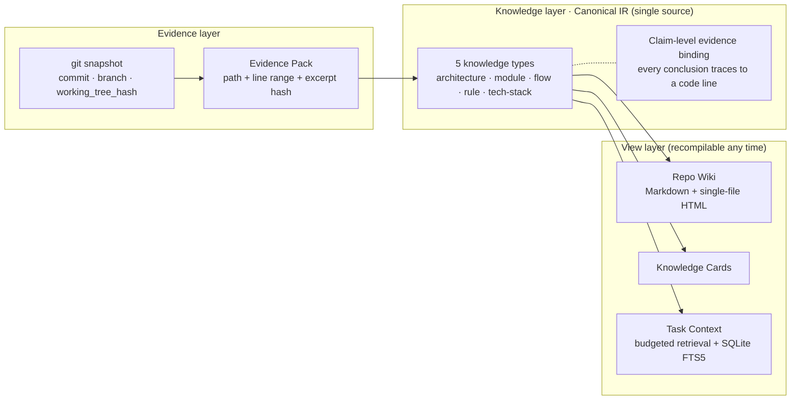
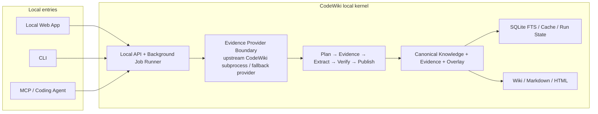
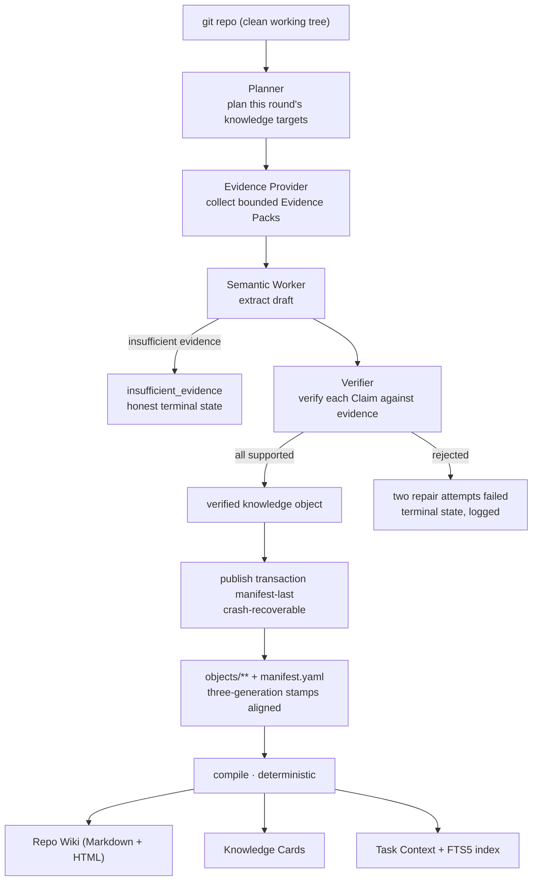
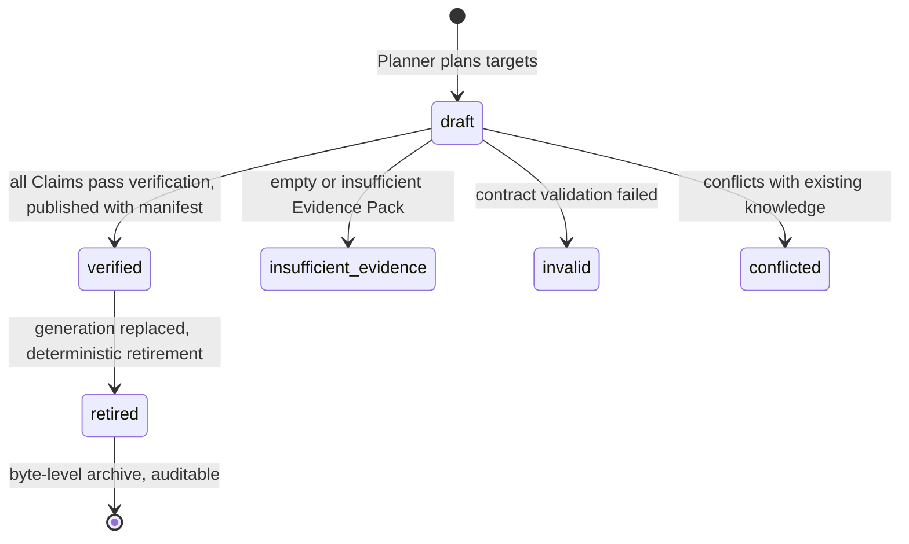

> ⚠️ 本翻译最后更新于 2026-09-21，主 README 于 2026-09-23 有多项修复未同步至此；最新内容以 [主文档](./README.md) 为准。

---
name: codewiki
description: Local-first repository knowledge compiler for AI coding agents. Distinguishes Evidence ≠ Knowledge ≠ Context: turns a git repo's verifiable facts into evidence-bound, commit-scoped structured knowledge, then deterministically compiles three views (Wiki / Cards / Task Context) from the same Canonical IR.
license: MIT (planned)
homepage: https://github.com/davyzhong/CodeWiki
audience: ai-coding-agents, individual-developers, tool-builders
intent: knowledge-compilation
capabilities:
  - install
  - build
  - compile
  - serve
  - mcp-server
  - audit
tags:
  - code-wiki
  - knowledge-compiler
  - evidence-bound
  - canonical-ir
  - mcp
  - local-first
  - ai-agent
---

**[English](./README.en.md)** · [中文](./README.md)

# CodeWiki — Repository Knowledge Compiler

[](scripts/verify.sh)
[](pyproject.toml)
[](pyproject.toml)
[](scripts/verify.sh)
[](docs/knowledge/methods/evidence-first-design.md)

**Languages**: [English](./README.md) · [中文](./README.zh.md)

**CodeWiki** (design name: Knowledge Compiler) is a **local-first** repository knowledge compiler for coding agents: it turns a git repository's **verifiable facts** into evidence-bound, commit-scoped structured knowledge, then deterministically compiles three views — Wiki, Knowledge Cards, and Task Context — from the same Canonical IR.

> One sentence: **Evidence ≠ Knowledge ≠ Context.** Evidence is the repo itself, knowledge is verified conclusions bound to that evidence, and context is the budgeted slice retrieved from knowledge. The three layers evolve independently, connected by compilation rather than a "universal vector store."

---

## Why CodeWiki exists

The three most common accidents when AI edits code are not "the model isn't smart enough" — they're **knowledge staleness**:

1. Citing a module or function that was already deleted or renamed in a previous iteration.
3. Parroting an architecture description from three months ago when the abstraction has since moved.
4. Treating another repo's or another team's conventions as this repo's rules.

The root cause: generic embedding retrieval answers "which text is similar to the question," never "**does this conclusion still hold at the current commit?**" CodeWiki makes this a first-class concern: knowledge objects bind three-generation stamps (generation / commit / working_tree_hash), and retrieval enforces **fail-closed gating** — snapshot mismatch refuses the answer. Better to give no context than stale context.

## Three-layer separation



- **Evidence layer** accepts only git facts: dirty working trees are refused outright by the retrieval gate.
- **Knowledge layer** is the only trusted source; every Claim must hang on an excerpt hash, and unverified Claims can never be marked verified.
- **View layer** is deterministically regenerated from the IR by `compile` (idempotent re-runs are byte-identical), never hand-edited.

## Product positioning (V0.1 → Local Beta)

V0.1 proved that the "trusted knowledge compilation" chain can close the loop. The next stage turns CodeWiki into a **long-term-use local knowledge product for individual developers**: install once, pick a repo, parse + build + read + query + supply agent context entirely on the local machine, with zero cloud-server dependency.

### One kernel, no "local vs cloud" split

CodeWiki has a single knowledge model and a single compile pipeline. The next-stage components all run locally — Web, CLI, and MCP are just different entry points into the same kernel:



After picking local deployment, the local machine owns the full job: reading the git repo, parsing code relations, collecting and verifying evidence, calling optional models, publishing structured knowledge, rebuilding the search index, generating the wiki, and serving it via local Web/CLI/MCP. It doesn't only store embeddings:

| Local data | Status | Purpose |
|-----------|--------|---------|
| Repository snapshot | Fact input | Anchors commit, branch, dirty state, and working-tree hash |
| Evidence | Authoritative source | Preserves source-code location, line range, excerpt, content hash |
| Canonical Knowledge | Authoritative knowledge | architecture / module / flow / rule / tech-stack + Claims |
| Human Overlay | Authoritative human input | Preserves manual edits; explicitly handles conflicts |
| Run State | Runtime state | Tasks, leases, retries, failures, generation history |
| SQLite FTS / cache | Rebuildable projection | Supports search, Task Context, performance optimization |
| Wiki / HTML / Markdown | Rebuildable artifact | Provides view for human reading, sharing, archiving |

**The vector database is neither the fact source nor a prerequisite for the local product.** Even if semantic vector indexing is added later, it remains projection data rebuildable from Canonical Knowledge; no "similar" result may bypass Claim verification and the snapshot gate.

## What gets produced (real screenshots)

The following screenshots come from a real five-type build (fixture repo + production pipeline end-to-end, not design mockups). Note the coverage bar honestly shows `none` for `architecture` and `tech-stack` — when evidence is insufficient, the system refuses to invent; it is product behavior, not demo accident:

<p align="center">
  
</p>

The module page shows a Scope table (repo / branch / commit anchor), responsibility list, and **per-Claim evidence collapse blocks** — evidence refs include permalinks (after configuring `init --web-url`, click to jump to the source line on GitHub/GitLab):

<p align="center">
  
</p>

The source-index page answers the inverse question "which knowledge objects cite this code" — evidence binding is bidirectional:

<p align="center">
  
</p>

`compile` also produces a **hostable multi-page static site** (`exports/site/`; the catalog table supports search / filter / sortable columns; Ask is evidence-only retrieval — it only returns matching Claims and evidence anchors, no generative answer). `knowledge serve` starts a local read-only server from the site directory (with a `/api/preview` task-context endpoint; the Ask panel auto-upgrades to server-backed mode); the site also includes `history.html` for generation timeline + two-generation knowledge diff. `knowledge open` opens a single-file HTML with dark mode + full-text search:

<p align="center">
  
</p>

### Build pipeline



Exit codes are the contract: `0` = complete, `2` = partial (individual targets with `insufficient_evidence` is normal product behavior), `1` = failed. Report lands at `.knowledge/state/runs/last-build.json`.

## Knowledge lifecycle



Surrounding this state machine is a set of **honesty semantics**: fail-closed retrieval gate (any of the three-generation stamps mismatch → refuse), deterministic retirement (same input always yields the same retired set), manifest-last publishing (recoverable to a consistent state after a crash), protected human overlay (`knowledge edit` with merge + conflict-resolution contract).

## Quick start

```bash
pip install -e ".[dev]"              # Python 3.12+; production deps only 4 packages

# Inside the target git repo root (working tree must be clean):
knowledge init --language zh --web-url https://github.com/org/repo   # init .knowledge/ (--web-url enables evidence permalink)
knowledge build --executor llm        # main build (LLM via LiteLLM; agent via queue protocol)
knowledge compile                     # deterministic Wiki/HTML + rebuild FTS index
knowledge context "task description"  # budgeted task context (verified-only, fail-closed)
knowledge open                    # open HTML Wiki (warns when behind)
knowledge serve                   # loopback-only read-only Wiki server
knowledge status                  # object state + latest run's target results
knowledge update --executor llm      # incremental update (exit codes same as build)
knowledge edit <object-id>           # edit protected human overlay

knowledge-mcp <repository-root>      # seven read-only MCP tools (stdio JSON-RPC)
```

LLM credentials only flow via environment variables (`KNOWLEDGE_EXTRACTION_MODEL` + the matching provider key) — never into the repo or `.knowledge/`.

## Validation loop

```bash
bash scripts/verify.sh
```

One command runs the whole production validation: two-pass test-suite consistency, `compileall`, artifact diff-check, `pip-audit`, and live-smoke auto-detection (executes a real end-to-end build when `codewiki` 0.6.x and env vars are present, otherwise explicitly lists the missing items and skips). `REQUIRE_LIVE=1` forces live failure to close; `VERIFY_FAST=1` skips the second pass.

## Project status

- **V0.1 main chain fully connected**: plan → evidence → extract → verify → atomic publish → incremental invalidation/retry/deterministic retirement → three-view verification → FTS/gated retrieval → CLI + MCP. Recovery-plan Gate 1–8 and conformance-fix Tasks 1–5 all complete.
- Offline baseline **787 tests passing (two-pass consistent)** + 1 opt-in live smoke default-skipped; core package current statement coverage **88%**.
- **M8 benchmark harness frozen and shipped** ([benchmark/](benchmark/README.md); four decisions in design doc §8). Real experiments await API key.
- Two remaining items await external input: live smoke with a real repo + API key (also: upstream codewiki 0.6.5 segfaults during `analyze` on a real mid-size repo — needs upstream fix or version bump, see [upstream run knowledge](docs/knowledge/industry/upstream-codewiki.md)); M8 experiment execution.

### Full review conclusions

| Dimension | Current base | Top open risk |
|-----------|--------------|---------------|
| Knowledge contract | 5 object types, Claim-level evidence, strict Pydantic | Contract file keeps growing; needs split between public semantics and type impls |
| Parsing ingestion | Provider abstraction, public CLI adapter, evidence budget + scrubbing | Upstream native crash can take down the real chain; capability discovery + degradation state not yet productized |
| Orchestration & recovery | Persistent queue, leases, retry, idempotency, crash recovery | Still file-state per repo, unsuitable as interactive task center |
| Publish & lifecycle | manifest-last, atomic write, conservative retirement, generation history | `generation.py` / `lifecycle.py` too large; future edits are cognitively heavy |
| Retrieval | verified-only, snapshot gate, SQLite FTS5, budget slicing | Lacks human-oriented ranking explanations, filters, repeatable quality evaluation |
| Human surface | Multi-page static site, search, Ask, history, diff | Read-only server capability is limited; info density, hierarchy, responsive design, accessibility insufficient |
| Agent surface | 7 read-only MCP tools, CLI Context, Skill | Web/CLI/MCP not yet sharing one service layer and complete error semantics |
| Testing & security | 787+1, 88% coverage, path / symlink / credential guards | CLI statement coverage ~67%; real-model, real-repo, install-upgrade verification insufficient |

Current code hot-spots:

- `compiler/wiki.py` simultaneously owns page model, styling, script, Markdown conversion, and multiple exports, exceeding 2,000 lines;
- `storage/generation.py` and `storage/lifecycle.py` simultaneously own safety validation, transactions, recovery, and business state;
- `contracts/knowledge.py` aggregates all knowledge types; adding a field widens blast radius;
- `cli.py` mixes command definition, user output, and application orchestration — hard to reuse as a Web API;
- Current `serving.py` is a safe local read-only server, but only serves static files + `/api/preview`, cannot back the next-version task manager.

These don't demand immediate rewrites, but are modules that must be split apart gradually when the next-stage service boundary is established; every split must keep Canonical IR, deterministic output, and existing CLI contracts unchanged.

## Industry horizontal comparison

This project learns from mature product experiences in its category, but doesn't treat "auto-generate a plausible-looking wiki" as the finish line:

<p align="center">
  <a href="docs/assets/local-beta-design-competitor-matrix.png">
    
  </a>
</p>

This matrix compares industry products across **core shape, parsing & retrieval, update & governance, human surface, agent surface, and learnable capabilities**. A searchable text version follows, supplemented by adjacent products like Backstage, GitBook, and Cursor:

| Product | Main strength | Borrowed pattern | CodeWiki's different choice |
|---------|---------------|------------------|----------------------------|
| [Qoder Repo Wiki](https://docs.qoder.com/qoder/repo-wiki) / [Knowledge Cards](https://docs.qoder.com/user-guide/knowledge-engine/knowledge-cards) | Wiki, Knowledge Cards, auto-update, team sharing, Agent Citation | First-run wizard, scope, pre-generate knowledge plan, manual-edit protection | Model manual content as Overlay, still subject to evidence + conflict gate |
| [DeepWiki](https://cognitionai.mintlify.app/work-with-devin/deepwiki) | Auto page tree, architecture diagrams, source links, Ask, MCP | `wiki.json`-style page planning, low-friction reading + querying | Pages are not the fact source; Ask must go back to Claim and Evidence |
| [Google Code Wiki](https://developers.googleblog.com/en/introducing-code-wiki-accelerating-your-code-understanding/) | Continuously-updated wiki, concept→definition hyperlinking, integrated Chat | High-level concept drill-down to classes, files | "Continuous generation" never replaces explicit currency verification |
| [GitHub Copilot Spaces](https://docs.github.com/en/copilot/copies/concepts/context/spaces) / [Memory](https://docs.github.com/en/copilot/concepts/agents/copilot-memory) | Shared context, cross-entry reuse, facts with refs verified before use | Inspectable / deletable knowledge, current-branch ref check, direct agent consumption | Knowledge objects + verification state are open, not vendor black-box memory |
| [Cursor Rules](https://docs.cursor.com/context/rules) | Repo-scoped, version-controlled, path-scoped Agent rules | Clear scope + persistent rule entry | Rules are just one of the 5 knowledge types, still need source evidence or human attribution |
| [Sourcegraph Cody](https://sourcegraph.com/docs/cody/core-concepts/context) | Code search, Code Graph, remote / multi-repo context | Structure + search combined, context selector, transparent results | Next round is single-repo local only; no premature multi-repo platform |
| [Augment Context Engine](https://docs.augmentcode.com/context-services/context-connectors/how-it-works) | discover/filter/hash/diff incremental indexing pipeline | File hash, incremental state, line-level results + capability state | Semantic similarity cannot be promoted to knowledge on its own |
| [PorunC/CodeWiki](https://github.com/PorunC/CodeWiki) | Multi-language AST, GraphRAG, Wiki, FastAPI/React, CLI/API/MCP | Broad parsing capability, graph exploration, complete product surface | Integration is only via public interface, with process isolation + fallback Provider for stability |
| [Backstage TechDocs](https://backstage.io/docs/features/techdocs/) / [GitBook AI Search](https://gitbook.com/docs/publishing-documentation/search-and-gitbook-assistant) | Mature doc navigation, search, source display, reading experience | Catalog, search, page layout, feedback + source interaction | Generated pages are always projections of structured knowledge, never another hand-maintained fact source |

The core differentiation that emerges:

> **Other products primarily answer "how to quickly generate and retrieve a repo description"; CodeWiki must additionally answer "what code supports this conclusion, does it still hold in the current snapshot, and why does it refuse to answer when evidence is insufficient."**

## Next round: trusted vertical slices

The next round advances on six vertical slices (M9–M14) instead of accumulating big versions by date. The full execution entry is the [Local Beta master plan](docs/superpowers/plans/active/2026-09-17-local-beta-master-plan.md), with each milestone sub-plan providing exact files, tests, commands, and commit boundaries. Each milestone must leave behind: operable user flow, underlying implementation, real-repo evidence, machine-readable result, and automated regression tests.

### M9 — Local product foundation

Goal: turn the source package into an installable, launchable, diagnosable local application.

- One command to launch local API, background worker, and Web UI;
- Establish unified configuration, app data directory, schema migration, backup/recovery boundaries;
- Provide first-launch wizard, environment pre-check, stable error codes, scrubbable diagnostic bundle;
- Extract reusable application services from hot-spots like `cli.py`, `compiler/wiki.py`, without changing existing command contracts;
- Ship built frontend assets with the Python package, avoiding separate frontend dev-tool installation.

**Exit criteria:** on a machine that has never seen CodeWiki, after following the documentation, the app can launch, the empty-repo home page opens, and the environmental capability state is clearly shown.

### M10 — Reliable repo ingestion and code parsing

Goal: any external parser's crash, timeout, or capability gap must not take down the main app.

- Define the Provider capability contract: supported languages, graph capability, incremental capability, version, health state;
- Run upstream CodeWiki inside a controlled subprocess, capture signals, timeouts, exit codes, and partial products;
- Introduce a safety-fallback Evidence Provider that still allows repo listing, text search, and bounded knowledge build when graph capability is unavailable;
- Improve include/exclude, binary/generated filter, cancel, retry, and checkpoint resume;
- Build smoke corpora for Python, TypeScript, C, etc. across different sizes;
- Distinguish ready / indexing / degraded / failed in the UI; do not pretend degradation is success.

**Exit criteria:** at least three repos outside this project can build repeatedly; deliberately triggering a parser crash still leaves the app usable, with cause, impact range, and recovery steps surfaced.

### M11 — Knowledge build task closed loop

Goal: users decide "what to generate", watch the full process, and recover from failure.

- Repo admission wizard + knowledge plan: templates, page tree, focus notes, include/exclude;
- Pre-build display: target count, evidence budget, model config, expected call volume;
- Background task center shows Plan / Evidence / Extract / Verify / Publish phases + per-target state;
- Support pause, resume, cancel, retry, and recovery after app restart;
- Bring manual Overlay, conflict handling, generation history, and knowledge diff into the same flow;
- All publishing continues to honor manifest-last and current-generation gate.

**Exit criteria:** recovering from mid-task failure, app restart, and partial-target insufficiency does not require users to delete `.knowledge/`; the final generation stays consistent.

### M12 — Knowledge reading beta

Goal: turn trusted state into an interface ordinary developers can understand and act on.

- New overview, knowledge map, object detail, sources, history, and diagnostic pages;
- Use architecture → domain → module/flow/rule/tech-stack hierarchy;
- Claim cards show conclusion, verification state, evidence summary, source-code permalink;
- Turn coverage, gap, stale, conflict, and parser degradation into explainable, actionable states;
- Add responsive layout, keyboard nav, contrast, focus state, screen-reader semantics;
- Hide raw hashes and overly long IDs from the default view while preserving the full audit drawer.

**Exit criteria:** from the repo overview, within three main actions, users can locate a key conclusion and its source code; core flow passes keyboard + automated a11y checks.

### M13 — Ask & Agent surface unification

Goal: humans and agents share the same retrieval, gate, budget, and error semantics.

- Finer-grained FTS indexes to Claim level; support type, state, path, and generation filters;
- Default Ask returns Claims, Evidence, and related objects; never overwrites knowledge gaps;
- Optional generative summary must cite each item, downgrade to evidence-only when citations are insufficient;
- Web, CLI, MCP, and internal API share the same application service + response schema;
- Provide Task Context preview, token / character budget, include/exclude reasons, copy/call entry;
- MCP adds capability discovery, task state, diagnostics, while keeping read-only knowledge consumption.

**Exit criteria:** for the same repo, same snapshot, same question, Web/CLI/MCP return a consistent evidence set; after dirtying the working tree, all three surfaces fail-closed for the same reason.

### M14 — Real value proof + local beta release

Goal: complete M8 real experiments, turn "feels useful" into reproducible data.

- Run knowledge-on / knowledge-off A/B with the frozen task set;
- Measure task accuracy, evidence sufficiency, stale-knowledge acceptance rate, latency, tokens, cost;
- Add cold-start, incremental update, mid-size repo, disk-full, and fault-injection tests;
- Freeze beta quality thresholds; if experiments don't hit them, return to the relevant milestone;
- Verify install, upgrade, data migration, backup, uninstall, and reinstall;
- Publish reproducible benchmark report, limits list, and local beta user manual.

**Exit criteria:** an isolated environment can re-run install + M8 experiment, results hit pre-frozen thresholds; all known limits have user-visible warnings or safe fallbacks.

### Explicit non-goals this round

- Cloud service, user system, multi-tenancy, organization permissions, billing, ops console;
- Continuous bidirectional sync between local and cloud;
- Multi-repo knowledge graph and org-level search;
- Mobile native client or desktop native shell;
- Default-deployment vector database;
- Generative features with no evidence of real benefit, just "to look like an AI product".

## Documentation map

Doc library uses three-tier governance (**materials → static KB → workflow artifacts**). Full state table: [docs/README.md](docs/README.md):

| Layer | Entry | Content |
|-------|-------|---------|
| Knowledge base (fact foundation) | [docs/knowledge/](docs/knowledge/README.md) | [Product definition](docs/knowledge/product/product-definition.md) · [Decision log D-001…](docs/knowledge/product/decision-log.md) · [Domain model](docs/knowledge/product/domain-model.md) · [Industry landscape](docs/knowledge/industry/landscape.md) · [Upstream CodeWiki](docs/knowledge/industry/upstream-codewiki.md) · [Evidence-first design](docs/knowledge/methods/evidence-first-design.md) · [As-built architecture](docs/knowledge/system/architecture.md) · [Behavior reference](docs/knowledge/system/behavior-reference.md) · [Security model](docs/knowledge/system/security-model.md) |
| Specs & plans | docs/superpowers/ | [V0.1 design spec (authoritative contract)](docs/superpowers/specs/2026-08-24-knowledge-compiler-v0-1-design.md) · [M8 A/B benchmark draft](docs/superpowers/plans/active/2026-09-02-m8-ab-benchmark-design.md) |
| Runbooks | docs/runbooks/ | [Live smoke runbook](docs/runbooks/2026-09-02-live-smoke.md) |

## Positioning & boundaries

| | Generic RAG / embedding retrieval | Upstream CodeWiki 0.6.x | This project — Knowledge Compiler |
| --- | --- | --- | --- |
| Knowledge shape | Text fragment similarity | Repo graph + retrieval service | 5 structured knowledge types + Claim-level evidence |
| Staleness semantics | None (similar ≠ true) | Defined by its own service | Three-generation stamps + fail-closed gate |
| Delivery | Retrieval results | Public CLI / MCP / HTTP | Wiki / Cards / Context three views + MCP |

For upstream [PorunC/CodeWiki](docs/knowledge/industry/upstream-codewiki.md), we only do **public interface integration** (CLI, MCP, HTTP) — no fork, no import of its internal modules, no reading its internal databases; the analyzed repo's source code, tests, and build scripts are **never executed**.