**[中文](./README.md)** · [English](./README.en.md)

# CodeWiki — 仓库知识编译器

  

[](scripts/verify.sh)
[](pyproject.toml)
[](pyproject.toml)
[](scripts/verify.sh)
[](docs/knowledge/methods/evidence-first-design.md)

**语言**：[English](./README.md) · [中文](./README.en.md)

> 📸 **Screenshots auto-generated by GitHub Actions** — see [`.github/workflows/screenshot.yml`](.github/workflows/screenshot.yml). Desktop + mobile README snapshots live under [`assets/screenshots/`](assets/screenshots/)。

**CodeWiki**（项目设计名：Knowledge Compiler）是一个面向 Coding Agent 的 local-first 仓库知识编译器：它把一个 git 仓库里**可验证的事实**，编译成带证据绑定、随提交过期的结构化知识，再从同一份 Canonical IR 确定性编译出 Wiki、知识卡片和任务上下文三种视图。

> 一句话：**Evidence ≠ Knowledge ≠ Context。证据是仓库本身，知识是被验证并绑定证据的结论，上下文是按预算从知识里检索出来的裁剪。** 三层各自独立演化，靠编译关系而非一个"万能向量库"连接。

---

## 下一阶段：面向个人开发者的本地知识产品

V0.1 已经证明了"可信知识编译"这条技术链可以闭环。下一阶段不再把 CodeWiki 只当成一组命令和静态生成物，而是把它做成个人开发者能够长期使用的**本地知识产品**：安装后选择一个仓库，在本机完成解析、建库、阅读、查询和 Agent 上下文供给，不依赖云服务器。

### 完整设计画布

下面三张图是本轮产品讨论形成的完整设计画布，不是概念宣传图。它们把项目体检、竞品横评、目标架构、产品旅程、界面草图、M9–M14 里程碑及范围边界放在同一套视觉语言里。可在本地直接打开[完整 HTML 设计稿](docs/design/2026-09-17-local-beta-design.html)，或查看[整页长图](docs/assets/local-beta-design-overview.png)。

<p align="center">
  <a href="docs/assets/local-beta-design-01-audit.png">
    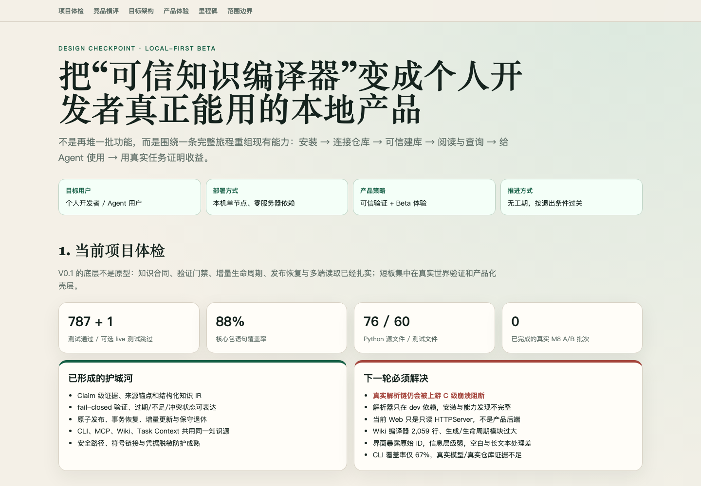
  </a>
</p>

<p align="center">
  <a href="docs/assets/local-beta-design-02-experience.png">
    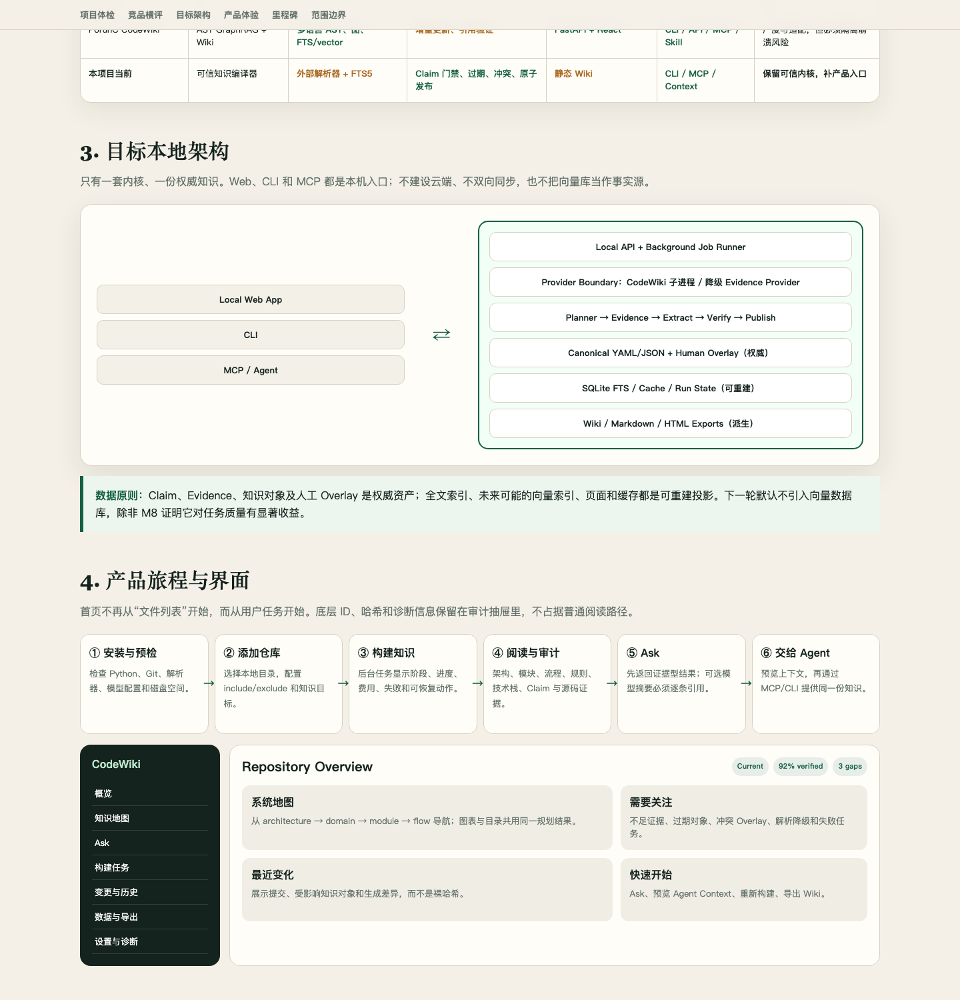
  </a>
</p>

<p align="center">
  <a href="docs/assets/local-beta-design-03-roadmap.png">
    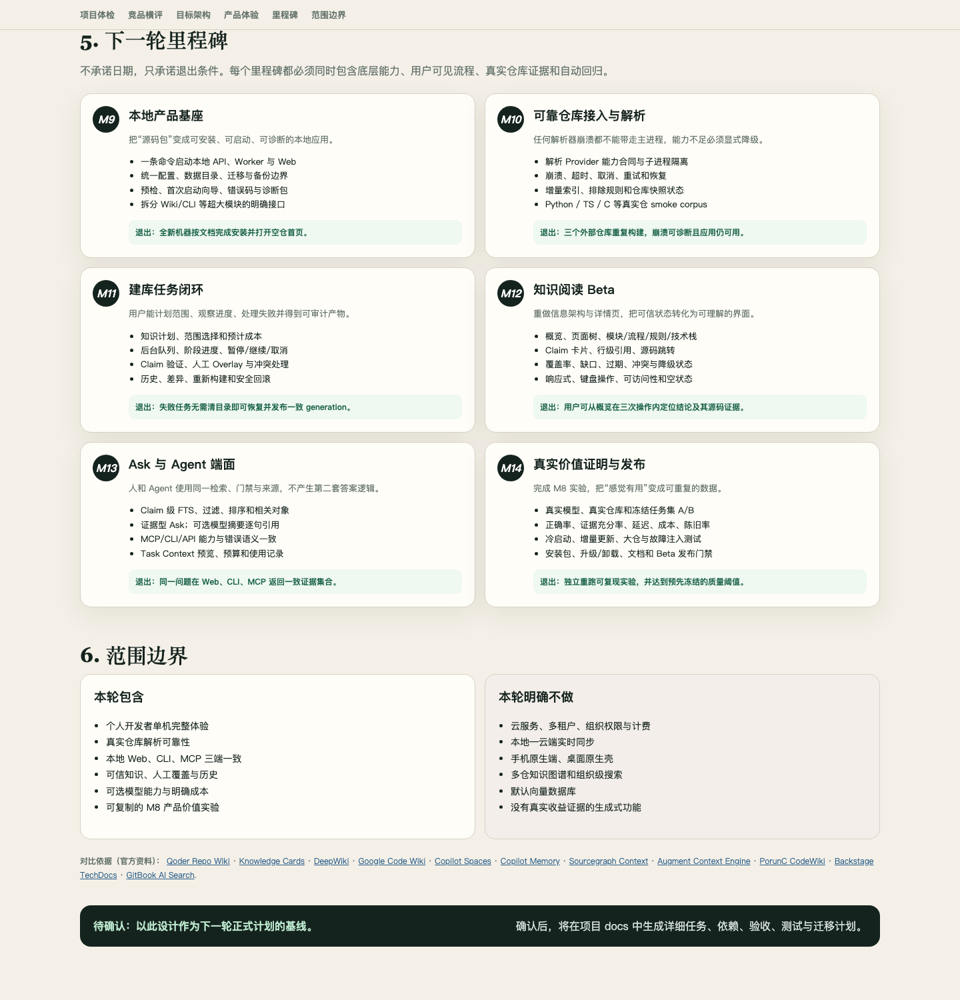
  </a>
</p>

| 决策 | 当前选择 |
| --- | --- |
| 首要用户 | 个人开发者、使用 Coding Agent 的开发者 |
| 部署形态 | 单机完整运行；零服务器依赖 |
| 产品策略 | 真实可信度验证与 Beta 使用体验并行 |
| 推进方式 | 不设时间承诺，以里程碑退出条件为准 |
| 权威数据 | Canonical Knowledge + Evidence + Human Overlay |
| 检索策略 | SQLite FTS5 默认；向量检索只有在基准证明收益后才引入 |

### 一套内核，不做"本地版"和"云端版"两套产品

CodeWiki 只有一套知识模型和一套编译管线。下一阶段所有组件均运行在本机，Web、CLI 与 MCP 只是访问同一内核的不同入口：

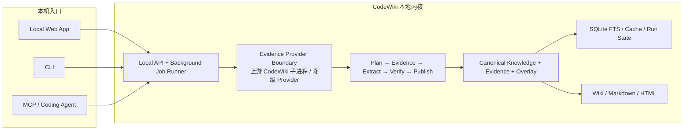

选择本地部署后，本机负责完整工作：读取 git 仓库、解析代码关系、收集和验证证据、调用可选模型、发布结构化知识、重建搜索索引、生成 Wiki，并通过本地 Web/CLI/MCP 提供服务。它保存的也不只是 embedding：

| 本地数据 | 地位 | 用途 |
| --- | --- | --- |
| 仓库快照 | 事实输入 | 锚定 commit、branch、dirty state 与 working-tree hash |
| Evidence | 权威来源 | 保存源码位置、行号区间、摘录与内容哈希 |
| Canonical Knowledge | 权威知识 | 保存 architecture/module/flow/rule/tech-stack 与 Claim |
| Human Overlay | 权威人工输入 | 保存人工修订，并显式处理冲突 |
| Run State | 运行状态 | 保存任务、租约、重试、失败与 generation 历史 |
| SQLite FTS / 缓存 | 可重建投影 | 支持搜索、Task Context 和性能优化 |
| Wiki / HTML / Markdown | 可重建制品 | 为人类阅读、分享和归档提供视图 |

**向量数据库不是事实源，也不是本地版成立的前提。** 即使未来增加语义向量索引，它仍然只是可以从 Canonical Knowledge 重建的派生数据；任何"相似"结果都不能绕过 Claim 验证和快照门禁。

## 为什么需要它

让 AI 改代码，最常见的三类事故都不是"模型不够聪明"，而是**知识过期**：

1. 引用一个上个迭代就已删除/改名的模块或函数；
2. 复述三个月前的架构描述，而抽象早已迁移；
3. 把别的仓库、别的团队的约定当成这个仓库的规则。

根因是通用的 embedding 检索只回答"哪段文本与问题相似"，从不回答"**这条结论在当前 commit 下还成立吗**"。CodeWiki 把这件事变成一等公民：知识对象绑定 generation / commit / working_tree_hash 三代际戳，检索时 fail-closed 门禁——快照不匹配就拒绝回答，宁可少给上下文，不给过期上下文。

## 核心思想：三层分离

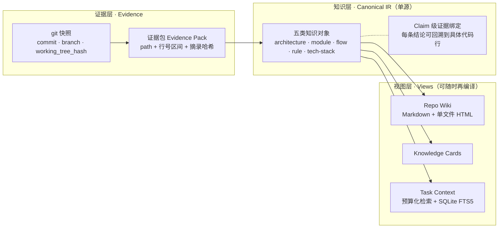

- **证据层**只认 git 事实：脏工作树会被检索门禁直接拒绝；
- **知识层**是唯一可信源，每条 Claim 必须挂在证据包的摘录哈希上，验证不通过就不能标记 verified；
- **视图层**全部由 `compile` 从 IR 确定性再生成（幂等重跑逐字节一致），从不手改。

## 它产出的东西（真实截图）

下面截图来自一次真实的五类型构建（fixture 仓库 + 生产管线完整跑通，非设计稿）。注意覆盖率条里 `architecture` 与 `tech-stack` 诚实显示 `none`——证据不足时系统拒绝编造，这是产品行为而不是演示事故：

<p align="center">
  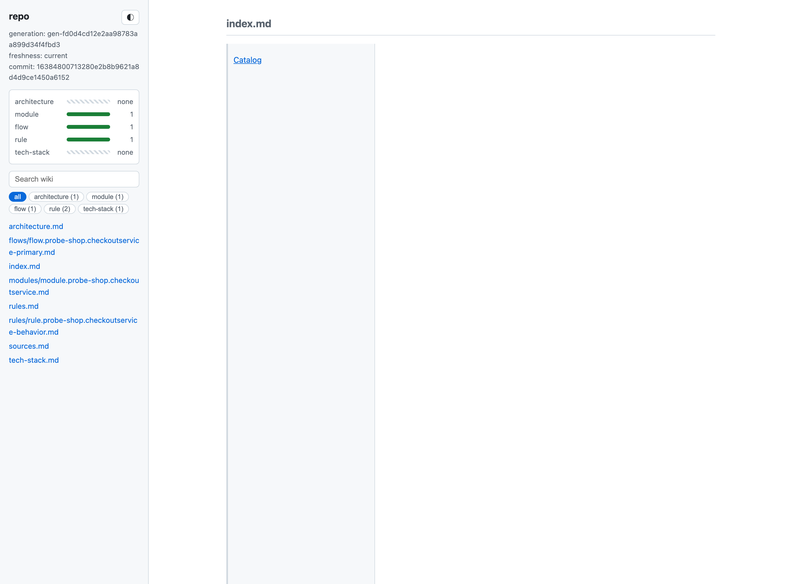
</p>

模块页展示 Scope 表（仓库/分支/commit 锚定）、职责列表，以及**每条 Claim 的证据折叠块**——证据引用带 permalink（`init --web-url` 配置后一键跳到 GitHub/GitLab 源码行）：

<p align="center">
  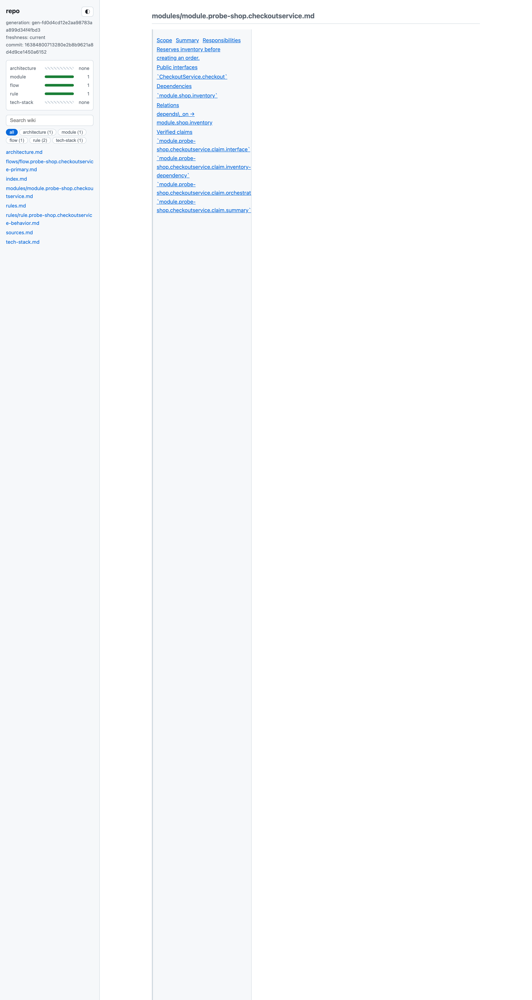
</p>

源索引页反向回答"这段代码被哪些知识引用"——证据绑定是双向可追溯的：

<p align="center">
  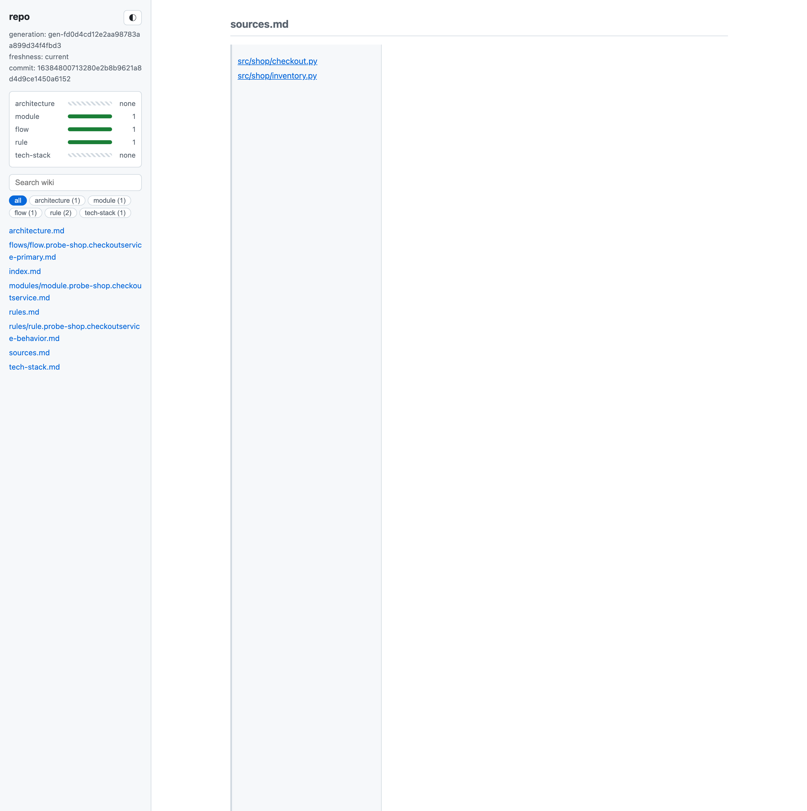
</p>

`compile` 同时产出一个**可托管的多页静态站点**（`exports/site/`，目录表支持搜索/过滤/列头排序，Ask 是 evidence-only 检索——只返回命中 Claim 与证据锚点，不做生成式回答）；`knowledge serve` 从站点目录起本地只读服务（含 `/api/preview` 任务上下文预览端点，Ask 面板自动升级为 server-backed 模式），站点另含 `history.html` 世代时间线与两代知识 diff；`knowledge open` 打开的单文件 HTML 支持 dark mode 与全文搜索：

<p align="center">
  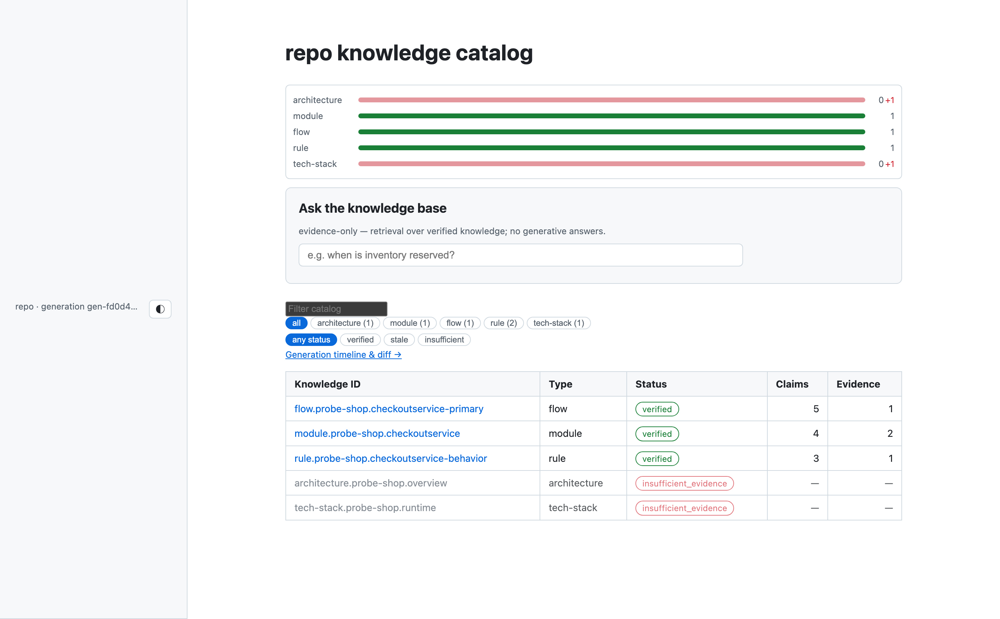
</p>

### 下一版的人类使用旅程

现有截图记录的是 V0.1 的真实产物，并非下一版界面承诺。下一轮会围绕一条完整用户旅程重组已有能力：

1. **安装与预检**：检查 Python、Git、解析器、模型配置和磁盘空间，给出可执行的修复建议；
2. **添加仓库**：选择本地目录，配置 include/exclude、语言和知识目标；
3. **构建知识**：后台任务展示当前阶段、目标进度、预计成本、失败原因和恢复动作；
4. **阅读与审计**：从架构总览进入模块、流程、规则和技术栈，逐条查看 Claim 与源码证据；
5. **Ask**：默认返回 evidence-only 结果，可选模型摘要必须逐条引用来源；
6. **交给 Agent**：先预览 Task Context，再通过 MCP 或 CLI 提供同一份已验证知识。

目标信息架构如下。底层 object ID、generation hash 和诊断细节不会删除，但会退到"审计与诊断"层，不再占据普通阅读路径：

```text
CodeWiki
├── 概览                  系统地图、可信覆盖率、缺口、最近变化
├── 知识地图
│   ├── 架构
│   ├── 模块
│   ├── 流程
│   ├── 规则
│   └── 技术栈
├── Ask                   Claim 级结果、证据、相关对象
├── 构建任务              阶段、进度、失败、重试、恢复
├── 变更与历史            generation 时间线、知识 diff、过期状态
├── 数据与导出            Markdown、HTML、诊断包、备份
└── 设置与诊断            Provider 能力、模型、范围、原始 ID
```

界面设计必须贯彻三个原则：

- **结论先于内部标识**：优先展示人能理解的名称、摘要与关系，原始 ID 按需展开；
- **可信状态可见**：verified、insufficient、stale、conflicted、degraded 都有明确解释和下一步动作；
- **三次操作内回到源码**：从概览到知识结论，再到支持该结论的代码行，最多三次主要交互。

## 构建管线

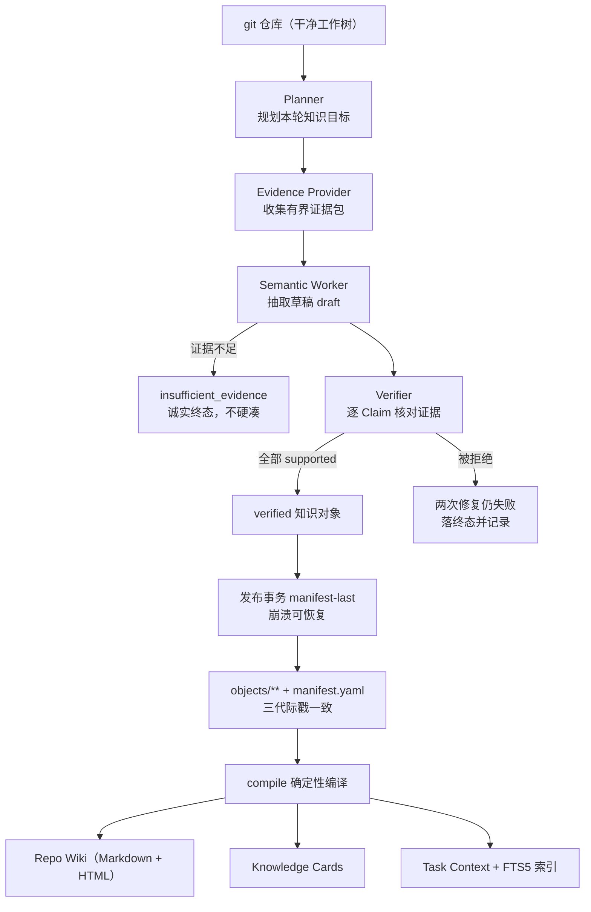

退出码即契约：`0` = complete，`2` = partial（个别目标 insufficient_evidence 属正常产品行为），`1` = failed；报告落在 `.knowledge/state/runs/last-build.json`。

## 知识生命周期

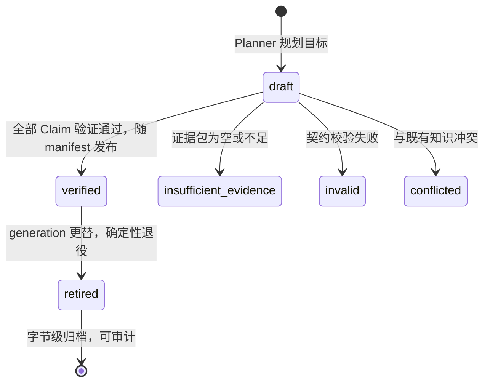

围绕这个状态机的是一组**诚实性语义**：检索门禁 fail-closed（三代际戳任一不匹配即拒绝）、retirement 确定性（同一输入永远得到同一退役集合）、发布 manifest-last（崩溃后可恢复到一致状态）、人类 overlay 受保护（`knowledge edit`，合并与冲突判定有契约）。

## 快速上手

```bash
pip install -e ".[dev]"              # Python 3.12+；生产依赖仅 4 个包

# 在目标 git 仓库根目录（工作树必须干净）：
knowledge init --language zh --web-url https://github.com/org/repo   # 初始化 .knowledge/（--web-url 启用证据 permalink）
knowledge build --executor llm        # 主构建（LLM 走 LiteLLM，Agent 走队列协议）
knowledge compile                     # 确定性 Wiki/HTML + 重建 FTS 索引
knowledge context "任务描述"           # 预算化任务上下文（verified-only，门禁 fail-closed）
knowledge open                        # 打开 HTML Wiki（落后时先告警）
knowledge serve                       # 仅回环只读 Wiki 服务
knowledge status                      # 对象状态 + 最新 run 的 target 结果
knowledge update --executor llm      # 增量更新（退出码同 build）
knowledge edit <object-id>           # 编辑受保护的人类 overlay

knowledge-mcp <repository-root>      # 七个只读 MCP 工具（stdio JSON-RPC）
```

LLM 凭据只经环境变量（`KNOWLEDGE_EXTRACTION_MODEL` + 对应 provider key），永不入库、不写入 `.knowledge/`。

## 验证闭环

```bash
bash scripts/verify.sh
```

一条命令完成生产验证：双遍测试套件一致性、`compileall`、产物 diff-check、`pip-audit`、live 冒烟自动探测（`codewiki` 0.6.x 与环境变量齐备时执行真实端到端构建，否则明确列出缺失项跳过）。`REQUIRE_LIVE=1` 强制 live 失败闭合，`VERIFY_FAST=1` 跳过第二遍。

## 项目状态

- **V0.1 主链路全线贯通**：规划 → 证据 → 抽取 → 验证 → 原子发布 → 增量失效/重试/确定性退役 → 三视图编译 → FTS/门禁检索 → CLI + MCP，恢复计划 Gate 1–8 与符合性修复 Task 1–5 全部完成。
- 离线基线 **787 项测试通过（双遍一致）** + 1 项 opt-in live 冒烟默认跳过；核心包当前语句覆盖率 **88%**。
- **M8 基准已冻结并落地 harness**（[benchmark/](benchmark/README.md)，dry-run 可跑；四项决策见设计文档 §8），真实实验等 API key。
- 剩余两件事都在等外部输入：真实仓库 + API key 的 live 冒烟（另：上游 codewiki 0.6.5 在真实中型仓库 analyze 段错误，需上游修复或版本升级，见 [upstream 运行知识](docs/knowledge/industry/upstream-codewiki.md)）；M8 实验执行。

### 全面 Review 结论

| 维度 | 已有基础 | 当前主要风险 |
| --- | --- | --- |
| 知识合同 | 五类对象、Claim 级证据、Pydantic 严格验证 | 合同文件体量持续增大，需要拆分公共语义和类型实现 |
| 解析接入 | Provider 抽象、公开 CLI 适配、证据预算与脱敏 | 上游原生崩溃可终止真实链路；能力发现与降级状态不够产品化 |
| 编排与恢复 | 持久队列、租约、重试、幂等、崩溃恢复 | 当前仍是仓库文件状态，不适合作为交互式任务中心直接使用 |
| 发布与生命周期 | manifest-last、原子写入、保守退休、世代历史 | `generation.py`、`lifecycle.py` 过大，后续改动的认知成本高 |
| 检索 | verified-only、快照门禁、SQLite FTS5、预算裁剪 | 缺少面向人的搜索排序解释、筛选和可重复质量评测 |
| 人类界面 | 多页静态站点、搜索、Ask、历史和 diff | 只读服务能力有限；信息密度、层级、响应式与可访问性不足 |
| Agent 端面 | 7 个只读 MCP 工具、CLI Context、Skill | Web/CLI/MCP 尚未共享统一的服务层和完整错误语义 |
| 测试与安全 | 787+1、88% 覆盖率、路径/符号链接/凭据防护 | CLI 语句覆盖率约 67%；真实模型、真实仓库、安装升级验证不足 |

当前最需要关注的代码热点：

- `compiler/wiki.py` 同时承担页面模型、样式、脚本、Markdown 转换与多种导出，已超过 2,000 行；
- `storage/generation.py` 与 `storage/lifecycle.py` 同时承担安全校验、事务、恢复和业务状态；
- `contracts/knowledge.py` 聚合全部知识类型，新增字段会扩大联动范围；
- `cli.py` 混合命令定义、用户输出和应用编排，难以直接复用为 Web API；
- 现有 `serving.py` 是安全的本地只读服务器，但只有静态文件与 `/api/preview`，不能承担下一版任务管理后端。

这些不是要求立即重写，而是下一阶段建立服务边界时必须逐步拆开的模块；每次拆分都要保持 Canonical IR、确定性输出和现有 CLI 契约不变。

## 行业横向比对与产品差异化

本项目借鉴同类产品的成熟体验，但不把"自动生成一篇看起来合理的 Wiki"当成终点：

<p align="center">
  <a href="docs/assets/local-beta-design-competitor-matrix.png">
    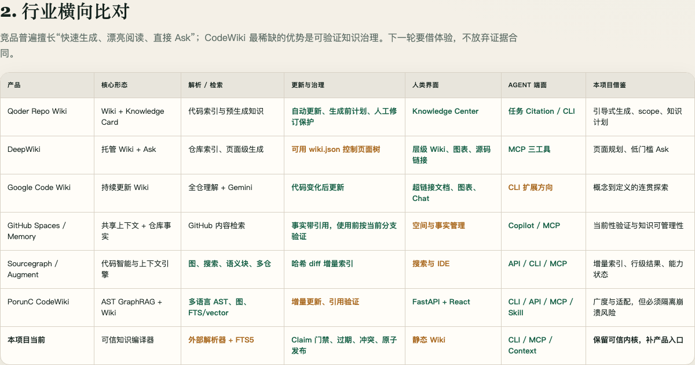
  </a>
</p>

这张矩阵从**核心形态、解析与检索、更新与治理、人类界面、Agent 端面、可借鉴能力**六个方面对照行业产品。下面保留可搜索、可复制的文字版本，并补充 Backstage、GitBook、Cursor 等相邻产品：

| 产品 | 主要优势 | 借鉴点 | CodeWiki 的不同选择 |
| --- | --- | --- | --- |
| [Qoder Repo Wiki](https://docs.qoder.com/qoder/repo-wiki) / [Knowledge Cards](https://docs.qoder.com/user-guide/knowledge-engine/knowledge-cards) | Wiki、Knowledge Card、自动更新、团队共享、Agent Citation | 首次生成向导、scope、生成前知识计划、人工修订保护 | 将人工内容建模为 Overlay，并继续接受证据与冲突门禁 |
| [DeepWiki](https://cognitionai.mintlify.app/work-with-devin/deepwiki) | 自动页面树、架构图、源码链接、Ask、MCP | `wiki.json` 式页面规划、低门槛阅读和查询 | 页面不是事实源；Ask 必须回到 Claim 和 Evidence |
| [Google Code Wiki](https://developers.googleblog.com/en/introducing-code-wiki-accelerating-your-code-understanding/) | 持续更新 Wiki、概念到定义的超链接探索、集成 Chat | 从高层概念连续下钻到文件、类和函数 | 不把"持续生成"替代显式当前性验证 |
| [GitHub Copilot Spaces](https://docs.github.com/en/copilot/concepts/context/spaces) / [Memory](https://docs.github.com/en/copilot/concepts/agents/copilot-memory) | 共享上下文、跨入口复用、事实带引用并在使用前验证 | 知识可查看/删除、引用当前分支校验、Agent 直接消费 | 知识对象和验证状态开放，不成为供应商黑盒记忆 |
| [Cursor Rules](https://docs.cursor.com/context/rules) | 仓库内、可版本化、按路径作用域的 Agent 规则 | 清晰的作用域和持久规则入口 | 规则只是五类知识之一，仍需源码证据或人工来源 |
| [Sourcegraph Cody](https://sourcegraph.com/docs/cody/core-concepts/context) | 代码搜索、Code Graph、远程/多仓上下文 | 结构与搜索结合、上下文选择器、结果透明 | 下一轮只做单仓本地产品，不提前建设多仓平台 |
| [Augment Context Engine](https://docs.augmentcode.com/context-services/context-connectors/how-it-works) | discover/filter/hash/diff 的增量索引管线 | 文件哈希、增量状态、行级结果和能力状态 | 语义相似度不能单独晋升为知识 |
| [PorunC/CodeWiki](https://github.com/PorunC/CodeWiki) | 多语言 AST、GraphRAG、Wiki、FastAPI/React、CLI/API/MCP | 广泛解析能力、图探索和完整产品端面 | 只经公开接口集成，并用进程隔离与降级 Provider 控制稳定性 |
| [Backstage TechDocs](https://backstage.io/docs/features/techdocs/) / [GitBook AI Search](https://gitbook.com/docs/publishing-documentation/search-and-gitbook-assistant) | 成熟的文档导航、搜索、来源展示和阅读体验 | 目录、搜索、页面布局、反馈和来源交互 | 生成页面始终是结构化知识的投影，而非另一份手工事实源 |

由此形成的核心差异化是：

> **其他产品主要回答"怎样快速生成和检索仓库说明"；CodeWiki 还必须回答"这条结论由什么代码支持、在当前快照是否仍然成立、证据不足时为什么拒绝回答"。**

## 下一轮里程碑：可信垂直切片

下一轮不按日期堆积大版本，而是按 M9–M14 六个垂直切片推进。完整执行入口见 [Local Beta 总实施计划](docs/superpowers/plans/active/2026-09-17-local-beta-master-plan.md)，并由六份里程碑子计划提供精确文件、测试、命令与提交边界。每个里程碑必须同时留下：用户可操作流程、底层实现、真实仓库证据、机器可读结果和自动回归测试。

### M9 — 本地产品基座

目标：把源码包变成可安装、可启动、可诊断的本地应用。

- 一条命令启动本地 API、后台 Worker 与 Web UI；
- 建立统一配置、应用数据目录、schema migration、备份/恢复边界；
- 提供首次启动向导、环境预检、稳定错误码和可脱敏诊断包；
- 从 `cli.py`、`compiler/wiki.py` 等热点中提取可复用应用服务，不改变现有命令契约；
- 将构建后的前端资源随 Python 包交付，避免用户分别安装前后端开发工具。

**退出条件：**在一台未配置过 CodeWiki 的机器上，按文档安装后可以启动应用、打开空仓首页，并看到明确的环境能力状态。

### M10 — 可靠仓库接入与代码解析

目标：任何外部解析器的崩溃、超时或能力不足都不能带走主应用。

- 定义 Provider capability contract：支持语言、图能力、增量能力、版本和健康状态；
- 把上游 CodeWiki 放入受控子进程，捕获 signal、超时、退出码和部分产物；
- 引入安全降级 Evidence Provider，在图能力不可用时仍可做仓库清单、文本检索和有限知识构建；
- 完善 include/exclude、二进制/生成物过滤、取消、重试和断点恢复；
- 建立 Python、TypeScript、C 等不同规模真实仓库的 smoke corpus；
- 在 UI 中区分 ready、indexing、degraded、failed，不把降级伪装成成功。

**退出条件：**至少三个非本项目仓库能够重复构建；故意触发解析崩溃后，应用仍可使用，并给出原因、影响范围和恢复动作。

### M11 — 建库任务闭环

目标：用户能决定"要生成什么"，观察全过程，并从失败中恢复。

- 仓库接入向导与知识计划：模板、页面树、重点说明、include/exclude；
- 构建前展示目标数、证据预算、模型配置和预计调用量；
- 后台任务中心显示 Plan/Evidence/Extract/Verify/Publish 阶段与 target 级状态；
- 支持暂停、继续、取消、失败重试和应用重启后的恢复；
- 将人工 Overlay、冲突处理、世代历史和知识 diff 纳入同一流程；
- 所有发布继续遵守 manifest-last 与 current-generation 门禁。

**退出条件：**从中途失败、应用重启和部分 target 不足三种场景恢复时，不需要用户删除 `.knowledge/`，且最终 generation 保持一致。

### M12 — 知识阅读 Beta

目标：把可信状态转换成普通开发者能理解和行动的界面。

- 新建概览、知识地图、对象类型详情、Sources、历史和诊断页面；
- 使用 architecture → domain → module/flow/rule/tech-stack 的层级导航；
- Claim 卡片展示结论、验证状态、证据摘要和源码 permalink；
- 将覆盖率、缺口、过期、冲突和解析降级做成可解释、可处理的状态；
- 增加响应式布局、键盘导航、对比度、焦点状态和屏幕阅读器语义；
- 隐藏默认视图中的裸哈希和超长 ID，同时保留完整审计抽屉。

**退出条件：**用户从仓库概览出发，在三次主要操作内定位一个关键结论及其源码证据；核心流程通过键盘和自动可访问性检查。

### M13 — Ask 与 Agent 端面统一

目标：人和 Agent 使用同一检索、门禁、预算和错误语义。

- 将 FTS 索引细化到 Claim 粒度，支持类型、状态、路径和 generation 筛选；
- 默认 Ask 返回 Claim、Evidence 和相关对象，不覆盖知识空白；
- 可选生成式摘要必须逐条引用，引用不足时降级为 evidence-only；
- Web、CLI、MCP、内部 API 共享应用服务与响应 schema；
- 提供 Task Context 预览、token/字符预算、包含/排除原因和复制/调用入口；
- MCP 增加能力发现、任务状态和诊断，但维持只读知识消费边界。

**退出条件：**同一仓库、同一快照、同一问题在 Web、CLI 和 MCP 返回一致证据集合；修改工作树后，三端均以同一原因 fail-closed。

### M14 — 真实价值证明与本地 Beta 发布

目标：完成 M8 真实实验，把"感觉有用"变成可复现的数据。

- 使用冻结任务集执行 knowledge-on / knowledge-off A/B；
- 测量任务正确率、证据充分率、陈旧知识接受率、延迟、token 与成本；
- 增加冷启动、增量更新、中型仓库、磁盘不足和故障注入测试；
- 冻结 Beta 质量阈值，实验结果不达标就回到相应里程碑修正；
- 验证安装、升级、数据迁移、备份、卸载和重新安装；
- 发布可复现的 benchmark report、限制清单和本地 Beta 使用手册。

**退出条件：**独立环境可以重跑安装与 M8 实验，结果达到预先冻结阈值；所有已知限制都有用户可见提示或安全降级。

### 本轮明确不做

- 云托管服务、用户系统、多租户、组织权限、计费和运营后台；
- 本地与云端的持续双向同步；
- 多仓知识图谱和组织级搜索；
- 手机原生端或桌面原生壳；
- 默认部署向量数据库；
- 没有真实收益证据、仅为了"看起来像 AI 产品"的生成式功能。

## 文档导航

文档库采用三层治理（**素材 → 静态知识库 → 工作流产物**），完整状态表见 [docs/README.md](docs/README.md)：

| 层 | 入口 | 内容 |
| --- | --- | --- |
| 知识库（事实基础） | [docs/knowledge/](docs/knowledge/README.md) | [产品定义](docs/knowledge/product/product-definition.md) · [决策日志 D-001…](docs/knowledge/product/decision-log.md) · [领域模型](docs/knowledge/product/domain-model.md) · [行业格局](docs/knowledge/industry/landscape.md) · [上游 CodeWiki](docs/knowledge/industry/upstream-codewiki.md) · [证据优先设计方法](docs/knowledge/methods/evidence-first-design.md) · [as-built 架构](docs/knowledge/system/architecture.md) · [行为参考](docs/knowledge/system/behavior-reference.md) · [安全模型](docs/knowledge/system/security-model.md) |
| 规格与计划 | docs/superpowers/ | [V0.1 设计规格（权威合同）](docs/superpowers/specs/2026-08-24-knowledge-compiler-v0-1-design.md) · [M8 A/B 基准草案](docs/superpowers/plans/active/2026-09-02-m8-ab-benchmark-design.md) |
| 操作手册 | docs/runbooks/ | [Live 冒烟手册](docs/runbooks/2026-09-02-live-smoke.md) |

## 定位与边界

| | 通用 RAG / embedding 检索 | 上游 CodeWiki 0.6.x | 本项目 Knowledge Compiler |
| --- | --- | --- | --- |
| 知识形态 | 文本片段相似度 | 仓库图谱与检索服务 | 五类结构化知识 + Claim 级证据 |
| 过期语义 | 无（相似 ≠ 为真） | 由其自身服务定义 | 三代际戳 + fail-closed 门禁 |
| 交付物 | 检索结果 | 公开 CLI / MCP / HTTP | Wiki / Cards / Context 三视图 + MCP |

对上游 [PorunC/CodeWiki](docs/knowledge/industry/upstream-codewiki.md) 只做**公开接口集成**（CLI、MCP、HTTP），不 fork、不导入其内部模块、不读其内部数据库；被分析仓库的源码、测试与构建脚本**永不执行**。