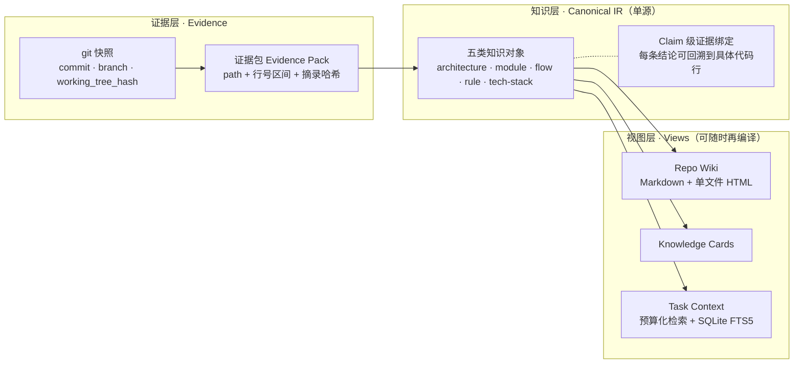
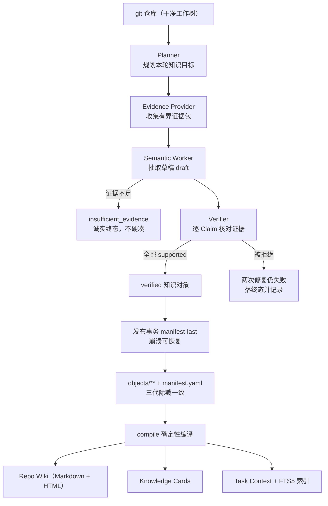
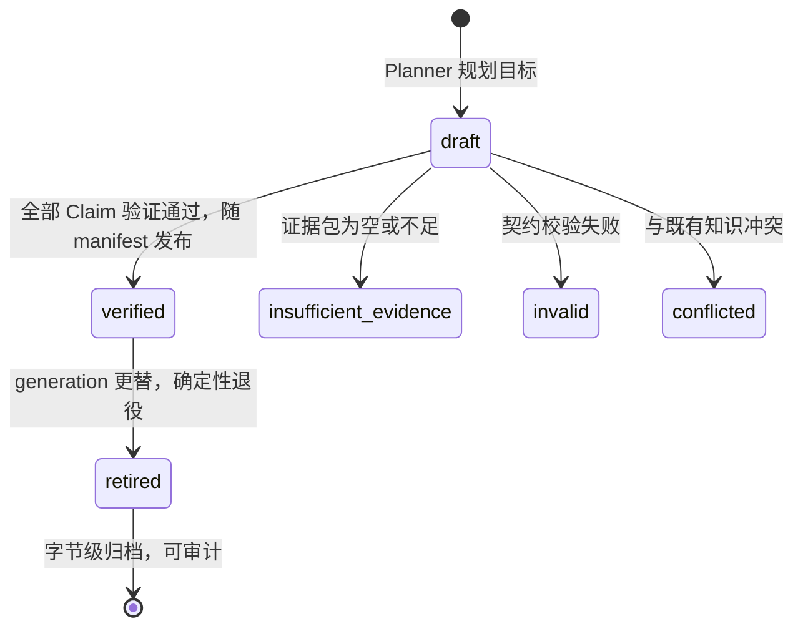

# CodeWiki — 仓库知识编译器

[](scripts/verify.sh)
[](pyproject.toml)
[](pyproject.toml)
[](scripts/verify.sh)
[](docs/knowledge/methods/evidence-first-design.md)

**CodeWiki**（项目设计名：Knowledge Compiler）是一个面向 Coding Agent 的 local-first 仓库知识编译器：它把一个 git 仓库里**可验证的事实**，编译成带证据绑定、随提交过期的结构化知识，再从同一份 Canonical IR 确定性编译出 Wiki、知识卡片和任务上下文三种视图。

> 一句话：**Evidence ≠ Knowledge ≠ Context。证据是仓库本身，知识是被验证并绑定证据的结论，上下文是按预算从知识里检索出来的裁剪。** 三层各自独立演化，靠编译关系而非一个"万能向量库"连接。

---

## 为什么需要它

让 AI 改代码，最常见的三类事故都不是"模型不够聪明"，而是**知识过期**：

1. 引用一个上个迭代就已删除/改名的模块或函数；
2. 复述三个月前的架构描述，而抽象早已迁移；
3. 把别的仓库、别的团队的约定当成这个仓库的规则。

根因是通用的 embedding 检索只回答"哪段文本与问题相似"，从不回答"**这条结论在当前 commit 下还成立吗**"。CodeWiki 把这件事变成一等公民：知识对象绑定 generation / commit / working_tree_hash 三代际戳，检索时 fail-closed 门禁——快照不匹配就拒绝回答，宁可少给上下文，不给过期上下文。

## 核心思想：三层分离



- **证据层**只认 git 事实：脏工作树会被检索门禁直接拒绝；
- **知识层**是唯一可信源，每条 Claim 必须挂在证据包的摘录哈希上，验证不通过就不能标记 verified；
- **视图层**全部由 `compile` 从 IR 确定性再生成（幂等重跑逐字节一致），从不手改。

## 它产出的东西（真实截图）

下面截图来自一次真实的五类型构建（fixture 仓库 + 生产管线完整跑通，非设计稿）。注意覆盖率条里 `architecture` 与 `tech-stack` 诚实显示 `none`——证据不足时系统拒绝编造，这是产品行为而不是演示事故：

<p align="center">
  
</p>

模块页展示 Scope 表（仓库/分支/commit 锚定）、职责列表，以及**每条 Claim 的证据折叠块**——证据引用带 permalink（`init --web-url` 配置后一键跳到 GitHub/GitLab 源码行）：

<p align="center">
  
</p>

源索引页反向回答"这段代码被哪些知识引用"——证据绑定是双向可追溯的：

<p align="center">
  
</p>

`compile` 同时产出一个**可托管的多页静态站点**（`exports/site/`，目录表支持搜索/过滤/列头排序，Ask 是 evidence-only 检索——只返回命中 Claim 与证据锚点，不做生成式回答）；`knowledge serve` 从站点目录起本地只读服务（含 `/api/preview` 任务上下文预览端点，Ask 面板自动升级为 server-backed 模式），站点另含 `history.html` 世代时间线与两代知识 diff；`knowledge open` 打开的单文件 HTML 支持 dark mode 与全文搜索：

<p align="center">
  
</p>

## 构建管线



退出码即契约：`0` = complete，`2` = partial（个别目标 insufficient_evidence 属正常产品行为），`1` = failed；报告落在 `.knowledge/state/runs/last-build.json`。

## 知识生命周期



围绕这个状态机的是一组**诚实性语义**：检索门禁 fail-closed（三代际戳任一不匹配即拒绝）、retirement 确定性（同一输入永远得到同一退役集合）、发布 manifest-last（崩溃后可恢复到一致状态）、人类 overlay 受保护（`knowledge edit`，合并与冲突判定有契约）。

## 快速上手

```bash
pip install -e ".[dev]"              # Python 3.12+；生产依赖仅 4 个包

# 在目标 git 仓库根目录（工作树必须干净）：
knowledge init --language zh --web-url https://github.com/org/repo   # 初始化 .knowledge/（--web-url 启用证据 permalink）
knowledge build --executor llm        # 主构建（LLM 走 LiteLLM，Agent 走队列协议）
knowledge compile                     # 确定性 Wiki/HTML + 重建 FTS 索引
knowledge context "任务描述"           # 预算化任务上下文（verified-only，门禁 fail-closed）
knowledge open                        # 打开 HTML Wiki（落后时先告警）
knowledge serve                       # 仅回环只读 Wiki 服务
knowledge status                      # 对象状态 + 最新 run 的 target 结果
knowledge update --executor llm      # 增量更新（退出码同 build）
knowledge edit <object-id>           # 编辑受保护的人类 overlay

knowledge-mcp <repository-root>      # 七个只读 MCP 工具（stdio JSON-RPC）
```

LLM 凭据只经环境变量（`KNOWLEDGE_EXTRACTION_MODEL` + 对应 provider key），永不入库、不写入 `.knowledge/`。

## 验证闭环

```bash
bash scripts/verify.sh
```

一条命令完成生产验证：双遍测试套件一致性、`compileall`、产物 diff-check、`pip-audit`、live 冒烟自动探测（`codewiki` 0.6.x 与环境变量齐备时执行真实端到端构建，否则明确列出缺失项跳过）。`REQUIRE_LIVE=1` 强制 live 失败闭合，`VERIFY_FAST=1` 跳过第二遍。

## 项目状态

- **V0.1 主链路全线贯通**：规划 → 证据 → 抽取 → 验证 → 原子发布 → 增量失效/重试/确定性退役 → 三视图编译 → FTS/门禁检索 → CLI + MCP，恢复计划 Gate 1–8 与符合性修复 Task 1–5 全部完成。
- 离线基线 **782 项测试通过（双遍一致）** + 1 项 opt-in live 冒烟默认跳过。
- **M8 基准已冻结并落地 harness**（[benchmark/](benchmark/README.md)，dry-run 可跑；四项决策见设计文档 §8），真实实验等 API key。
- 剩余两件事都在等外部输入：真实仓库 + API key 的 live 冒烟（另：上游 codewiki 0.6.5 在真实中型仓库 analyze 段错误，需上游修复或版本升级，见 [upstream 运行知识](docs/knowledge/industry/upstream-codewiki.md)）；M8 实验执行。

## 文档导航

文档库采用三层治理（**素材 → 静态知识库 → 工作流产物**），完整状态表见 [docs/README.md](docs/README.md)：

| 层 | 入口 | 内容 |
| --- | --- | --- |
| 知识库（事实基础） | [docs/knowledge/](docs/knowledge/README.md) | [产品定义](docs/knowledge/product/product-definition.md) · [决策日志 D-001…](docs/knowledge/product/decision-log.md) · [领域模型](docs/knowledge/product/domain-model.md) · [行业格局](docs/knowledge/industry/landscape.md) · [上游 CodeWiki](docs/knowledge/industry/upstream-codewiki.md) · [证据优先设计方法](docs/knowledge/methods/evidence-first-design.md) · [as-built 架构](docs/knowledge/system/architecture.md) · [行为参考](docs/knowledge/system/behavior-reference.md) · [安全模型](docs/knowledge/system/security-model.md) |
| 规格与计划 | docs/superpowers/ | [V0.1 设计规格（权威合同）](docs/superpowers/specs/2026-08-24-knowledge-compiler-v0-1-design.md) · [M8 A/B 基准草案](docs/superpowers/plans/active/2026-09-02-m8-ab-benchmark-design.md) |
| 操作手册 | docs/runbooks/ | [Live 冒烟手册](docs/runbooks/2026-09-02-live-smoke.md) |

## 定位与边界

| | 通用 RAG / embedding 检索 | 上游 CodeWiki 0.6.x | 本项目 Knowledge Compiler |
| --- | --- | --- | --- |
| 知识形态 | 文本片段相似度 | 仓库图谱与检索服务 | 五类结构化知识 + Claim 级证据 |
| 过期语义 | 无（相似 ≠ 为真） | 由其自身服务定义 | 三代际戳 + fail-closed 门禁 |
| 交付物 | 检索结果 | 公开 CLI / MCP / HTTP | Wiki / Cards / Context 三视图 + MCP |

对上游 [PorunC/CodeWiki](docs/knowledge/industry/upstream-codewiki.md) 只做**公开接口集成**（CLI、MCP、HTTP），不 fork、不导入其内部模块、不读其内部数据库；被分析仓库的源码、测试与构建脚本**永不执行**。
